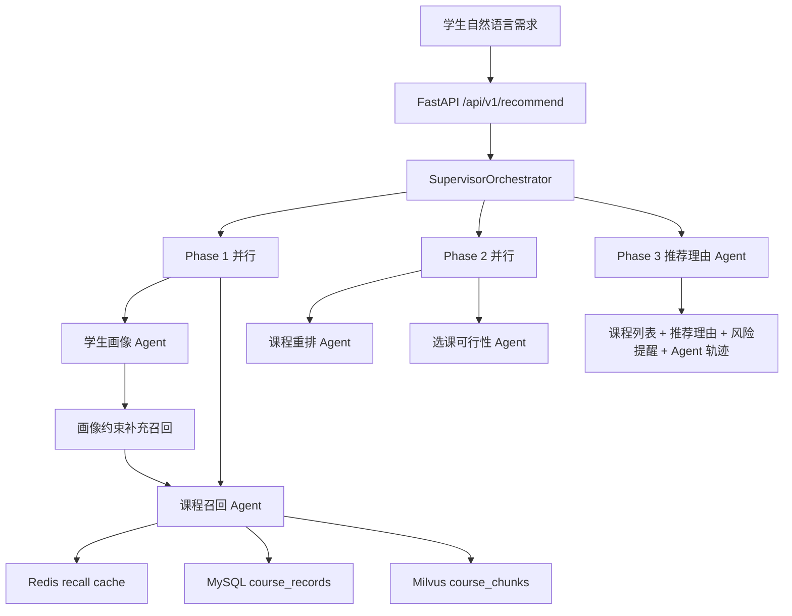

# 学校公选课 Multi-Agent 推荐系统

面向教务选课场景的 AI Agent 项目：学生用自然语言描述选课偏好，系统从真实公选课数据集中召回、排序、检查可选风险，并返回可解释的课程推荐。

这个仓库历史名称仍是 `multi-agent-ecommerce-system`，部分模型和环境变量也保留了电商阶段的兼容字段。但当前文档和 Python 主链路以“学校公选课推荐”为唯一主线。

## 项目解决什么问题

学生选公选课时，需求往往不是一个关键词能表达的。一个典型输入可能同时包含兴趣、校区、时间、考核方式、作业量、给分倾向和抢课风险：

```text
我想选一门不考试、作业少、给分友好的公选课，最好在东校区，周三晚上不要有课，
我对电影、心理学和艺术比较感兴趣，不想做小组作业。
```

普通搜索只能匹配课程名或标签，很难同时处理“不要考试”“给分友好”“避开某个时间段”“爆满但值得冲刺”这类混合约束。本项目把选课决策拆成多个 Agent，让每一步都有清晰输入、输出和可追踪结果。

最终响应会包含：

- 推荐课程列表
- 每门课的推荐理由
- 容量爆满、容量紧张、时间冲突、年级/专业/先修限制等风险提醒
- 每个 Agent 的执行结果和耗时，便于调试与面试讲解

## 核心能力

| 能力 | 实现方式 | 关键代码 |
|---|---|---|
| 自然语言画像抽取 | LLM 将 prompt 转为 `StudentProfile` | `python/agents/student_profile_agent.py` |
| 课程召回 | Redis 候选缓存 + MySQL 结构化筛选 + Milvus 课程 chunk 语义检索 | `python/agents/course_recall_agent.py` |
| 个性化重排 | LLM 在候选课程 ID 内排序，解析失败回退规则排序 | `python/agents/course_rerank_agent.py` |
| 可行性检查 | 时间、容量、年级、专业、先修要求等规则判断 | `python/agents/course_feasibility_agent.py` |
| 推荐解释 | 基于课程字段和风险信息生成可执行建议 | `python/agents/recommendation_reason_agent.py` |
| 编排与观测 | Supervisor 三阶段编排、Agent 耗时统计、实验分组 | `python/orchestrator/supervisor.py` |

## 系统架构



主 API 使用 `python/orchestrator/supervisor.py`。同一条业务链路也提供了 `python/orchestrator/graph.py` 的 LangGraph 展示版本，对外接口是 `POST /api/v1/recommend/graph`。

## Agent 编排逻辑

`SupervisorOrchestrator.recommend()` 按三阶段执行：

1. Phase 1 并行运行学生画像 Agent 和课程召回 Agent。召回先基于原始 prompt 做宽召回；如果画像抽取成功，再根据领域、分类、校区等强约束补一次结构化召回。
2. Phase 2 并行运行课程重排 Agent 和选课可行性 Agent。前者决定推荐顺序，后者过滤硬冲突并生成容量、考试、小组作业等风险提醒。
3. Phase 3 串行运行推荐理由 Agent，因为解释必须基于最终课程列表和风险结果。

这种拆分不是为了堆概念，而是为了让“理解学生”“找课程”“排顺序”“查风险”“解释原因”分别可测试、可降级、可排查。

## 热点召回缓存

当多个学生同时询问相似需求时，例如“东校区、不考试、作业少、给分友好”，系统不需要每次都重新做 Milvus 向量检索和 MySQL 宽召回。`CourseRecallAgent` 会先根据结构化画像生成稳定 cache key，并尝试从 Redis 读取候选 `course_id` 列表。

命中缓存时：

```text
Redis course_id list
  -> MySQL fetch_courses_by_ids 回表拿最新课程
  -> 后续重排、可行性检查、推荐理由
```

未命中时：

```text
Redis SET lock NX EX
  -> 拿到短锁的请求执行 MySQL + Milvus 完整召回
  -> 写入候选 course_id list，默认 TTL 15 分钟
  -> 其他同 key 请求短暂等待后优先复用缓存
```

这里缓存的是“候选集索引”，不是完整课程对象；容量、已选人数、年级/专业限制等事实字段仍以 MySQL 回表结果为准。

## 数据层设计

已有课程 CSV：

`course_dataset_tools/output/public_elective_courses.csv`

导入脚本：

`python/scripts/ingest_course_dataset.py`

导入后形成两层数据：

| 层 | 存储内容 | 作用 |
|---|---|---|
| MySQL `course_records` | 每门课完整结构化字段和原始 JSON | 结构化过滤、回表展示、容量/限制判断 |
| MySQL `course_chunks` | 每门课拆分后的文本块内容和元数据 | 保存可追踪 chunk 文本 |
| Milvus `course_chunks` | chunk embedding | 自然语言语义召回 |

每门课默认拆成 4 类 chunk：

| chunk 类型 | 覆盖字段 | 适合命中的需求 |
|---|---|---|
| `basic` | 课程名、教师、学分、分类、领域 | “心理学”“艺术类”“某老师” |
| `schedule_capacity` | 校区、上课时间、地点、容量、热度、抢课建议 | “东校区”“周三晚上不要”“别太难抢” |
| `learning_profile` | 简介、考核、难度、作业量、给分、考试、小组作业 | “不考试”“作业少”“给分友好” |
| `audience_tags` | 年级、专业、先修、适合人群、标签、历史选课比例 | “适合低年级”“没有先修要求” |

这样设计的原因是：整行 CSV 直接 embedding 会把时间、容量、学习体验和适合人群混在一起，语义命中不稳定；分块后可以让不同类型的需求命中更具体的课程片段，再通过 `course_id` 回 MySQL 拿完整记录。

## 快速运行

### 1. 安装依赖

```bash
cd python
python -m pip install -r requirements.txt
```

### 2. 配置环境变量

在 `python/.env` 中配置 OpenAI 兼容 LLM 和 embedding。当前代码保留 `ECOM_` 前缀，这是历史兼容设计，不代表当前业务仍是电商。

```env
ECOM_LLM_API_KEY=你的LLM Key
ECOM_LLM_BASE_URL=https://你的OpenAI兼容地址/v1
ECOM_LLM_MODEL=你的模型

ECOM_EMBEDDING_PROVIDER=local
ECOM_EMBEDDING_DIMENSION=64
ECOM_MILVUS_DIMENSION=64
ECOM_COURSE_MILVUS_COLLECTION=course_chunks
```

默认 `local` embedding 是确定性本地向量，适合低成本跑通流程。如果换成真实 embedding 服务，需要保持 `ECOM_EMBEDDING_DIMENSION` 与 `ECOM_MILVUS_DIMENSION` 一致。

### 3. 启动依赖服务

```bash
docker compose -f docker-compose.python.yml --profile python up -d --build
```

### 4. 导入课程数据

建议先导入少量数据验证链路，再导入完整 CSV：

```bash
cd python
python scripts/ingest_course_dataset.py --limit 20
python scripts/ingest_course_dataset.py
```

脚本会完成：

1. 读取 `course_dataset_tools/output/public_elective_courses.csv`
2. 写入 MySQL `course_records`
3. 生成 `basic`、`schedule_capacity`、`learning_profile`、`audience_tags` 四类 chunk
4. 写入 MySQL `course_chunks`
5. 生成 embedding 并写入 Milvus

### 5. 启动 API

```bash
cd python
uvicorn main:app --host 0.0.0.0 --port 8000
```

### 6. 健康检查

```bash
curl http://localhost:8000/health
```

`/health` 会检查 MySQL、Redis、Milvus 是否可达。Redis 当前用于课程召回候选 `course_id` 列表缓存，并保留历史 Feature Store 封装；学生画像仍主要来自当次 prompt 和 context。

## 推荐接口示例

Windows PowerShell：

```powershell
curl.exe -X POST "http://localhost:8000/api/v1/recommend" `
  -H "Content-Type: application/json" `
  -d "{\"user_id\":\"S10001\",\"num_items\":5,\"prompt\":\"想选不考试、作业少、给分友好的艺术类公选课，东校区优先，周三晚上不要有课\",\"context\":{\"avoid_time_slots\":[\"周三第9-10节\"],\"campus\":[\"东校区\"]}}"
```

Linux/macOS：

```bash
curl -X POST "http://localhost:8000/api/v1/recommend" \
  -H "Content-Type: application/json" \
  -d '{"user_id":"S10001","num_items":5,"prompt":"想选不考试、作业少、给分友好的艺术类公选课，东校区优先，周三晚上不要有课","context":{"avoid_time_slots":["周三第9-10节"],"campus":["东校区"]}}'
```

响应结构示例：

```json
{
  "request_id": "7d6d...",
  "user_id": "S10001",
  "courses": [
    {
      "course_id": "GXK2026003",
      "course_name": "风景地貌学",
      "teacher": "杨雪强",
      "domain": "自然环境",
      "campus": "东校区",
      "time_slot": "周四第7-8节",
      "has_exam": "否",
      "workload": "中",
      "grade_friendly": "中"
    }
  ],
  "recommendation_reasons": [
    {
      "course_id": "GXK2026003",
      "reason": "课程位于东校区且不考试，内容偏自然环境拓展，适合希望用公选课拓宽知识面的学生；但当前热度较高，建议提前抢课。"
    }
  ],
  "selection_warnings": [
    {
      "course_id": "GXK2026003",
      "level": "high",
      "type": "capacity_full",
      "message": "当前已选人数达到或超过容量，建议作为冲刺志愿并准备替代课程。"
    }
  ],
  "experiment_group": "control",
  "total_latency_ms": 1530.2
}
```

## API 清单

| 方法 | 路径 | 说明 |
|---|---|---|
| `POST` | `/api/v1/recommend` | Supervisor 主链路课程推荐 |
| `POST` | `/api/v1/recommend/graph` | LangGraph 状态图展示链路 |
| `GET` | `/api/v1/experiments` | 查看进程内 A/B 实验状态 |
| `POST` | `/api/v1/experiments/{experiment_id}/outcome` | 记录实验结果 |
| `GET` | `/api/v1/metrics` | 查看进程内 Agent 与业务指标 |
| `GET` | `/health` | 检查 MySQL、Redis、Milvus |

## 项目结构

```text
multi-agent-ecommerce-system/
├── README.md
├── docker-compose.python.yml
├── course_dataset_tools/
│   └── output/public_elective_courses.csv
├── docs/
│   ├── architecture.md
│   ├── code-walkthrough.md
│   ├── interview-guide.md
│   ├── resume-template.md
│   └── plans/2026-05-11-course-agent-redesign.md
├── python/
│   ├── main.py
│   ├── config/settings.py
│   ├── models/schemas.py
│   ├── orchestrator/
│   │   ├── supervisor.py
│   │   └── graph.py
│   ├── agents/
│   │   ├── base_agent.py
│   │   ├── student_profile_agent.py
│   │   ├── course_recall_agent.py
│   │   ├── course_rerank_agent.py
│   │   ├── course_feasibility_agent.py
│   │   └── recommendation_reason_agent.py
│   ├── repositories/
│   │   ├── course_repository.py
│   │   ├── course_recall_cache_repository.py
│   │   ├── course_vector_repository.py
│   │   ├── mysql_repository.py
│   │   └── redis_repository.py
│   └── scripts/ingest_course_dataset.py
└── scripts/init-db.sql
```

仓库中仍保留 Java、Go、前端和根 `docker-compose.yml` 等历史/对照内容。当前公选课主推荐链路以 `python/` 和 `docker-compose.python.yml` 为准。

## 常见问题与排障

### MySQL 或 Milvus 未就绪

先启动依赖服务：

```bash
docker compose -f docker-compose.python.yml --profile python up -d --build
```

再访问 `GET /health`。如果 Milvus 仍不可用，先确认端口 `19530`、collection 名和 embedding 维度。

### embedding 维度不一致

`ECOM_EMBEDDING_DIMENSION`、`ECOM_MILVUS_DIMENSION`、Milvus collection 已存在维度必须一致。如果你之前用旧维度写入过数据，建议清空对应 collection 后重新导入。

### 课程 collection 名称不一致

课程向量库默认使用 `ECOM_COURSE_MILVUS_COLLECTION=course_chunks`。根历史配置里的 `ECOM_MILVUS_COLLECTION=product_embeddings` 是商品向量遗留配置，不是当前课程 chunk 的推荐 collection。

### Redis 缓存命中但课程状态变化

Redis 只缓存候选 `course_id` 列表，不缓存完整课程对象。命中后仍会调用 MySQL 回表，因此容量、已选人数、限制条件会使用最新数据。如果缓存 ID 回表为空，召回链路会忽略缓存并回退完整 MySQL + Milvus 召回。

### LLM 输出不是合法 JSON

画像、重排和推荐理由 Agent 都要求 LLM 输出 JSON。当前代码做了 Markdown 代码块清理和解析失败回退：画像失败走启发式画像，重排失败走规则排序，推荐理由失败走字段拼接。

### 为什么最终课程少于 `num_items`

选课可行性 Agent 会过滤硬冲突课程，例如时间命中 `avoid_time_slots`、年级/专业限制不匹配、缺少先修要求。过滤后可用课程不足时，最终列表会少于请求数量。

## 面试亮点

- **场景不是套壳 RAG**：系统不只是检索课程后回答，而是要完成召回、排序、风险判断和可解释决策。
- **Multi-Agent 拆分有依赖依据**：画像和宽召回可并行，重排和可行性检查可并行，推荐理由依赖最终结果所以串行。
- **结构化数据与语义检索结合**：MySQL 负责精确字段和回表，Milvus 负责自然语言语义召回。
- **热点召回缓存**：Redis 缓存结构化画像对应的候选 `course_id` 列表，用短锁防止同类并发请求击穿召回层。
- **降低 LLM 幻觉**：LLM 重排只能输出候选课程 ID，推荐理由只能基于输入字段生成，最终课程来自 MySQL。
- **真实数据闭环**：从公选课 CSV 到 MySQL/Milvus，再到 FastAPI 推荐接口，能完整演示。
- **边界诚实**：Redis 已接入召回候选缓存，但不是实时学生画像来源；A/B、metrics 仍是轻量进程内框架。

## 简历写法

```text
学校公选课 Multi-Agent 推荐系统 | 个人项目 | 2026.05
• 设计并实现面向教务系统的公选课推荐 Agent 系统，支持学生用自然语言描述兴趣、时间、校区、考核方式和学习负担偏好
• 采用 Supervisor 模式编排学生画像、课程召回、课程重排、选课可行性和推荐理由 5 个 Agent，将选课决策拆成可追踪、可降级的阶段
• 基于 MySQL + Milvus 构建课程 RAG 数据层，将公选课 CSV 拆分为 basic、schedule_capacity、learning_profile、audience_tags 四类语义 chunk
• 在召回阶段结合结构化筛选与向量检索，在重排阶段约束 LLM 只从候选课程 ID 中排序，降低推荐不存在课程的风险
• 使用 Redis 缓存结构化画像对应的候选 course_id 列表，命中后回 MySQL 获取最新课程状态，减少热点需求重复召回
• 实现容量爆满、时间冲突、年级/专业/先修限制等选课风险判断，输出推荐理由和抢课建议

技术栈：FastAPI · LangGraph · Multi-Agent · Milvus · MySQL · Redis · Docker · OpenAI-Compatible LLM
```

## 相关文档

- `docs/architecture.md`：系统架构与数据流
- `docs/code-walkthrough.md`：逐文件代码讲解
- `docs/interview-guide.md`：面试问答与项目讲法
- `docs/resume-template.md`：简历与 STAR 包装
- `docs/plans/2026-05-11-course-agent-redesign.md`：课程场景改造设计记录
