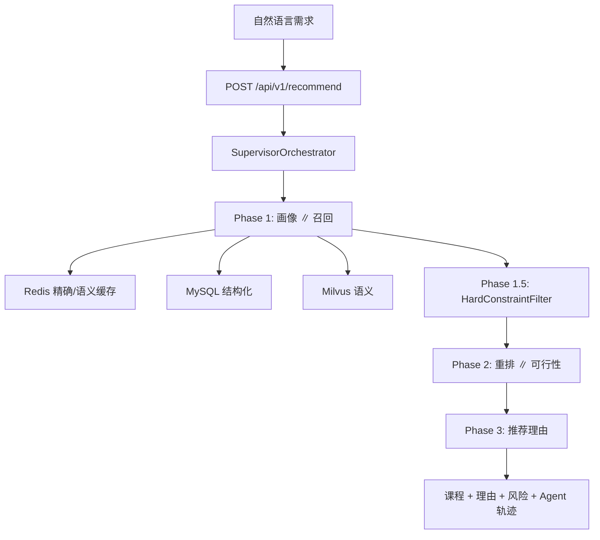

# 学校公选课 Multi-Agent 推荐系统

学生用自然语言描述选课偏好，系统从约 500 门公选课中完成召回、硬约束过滤、排序、风险检查与可解释推荐。

## 快速启动

默认在仓库根目录操作，Compose 文件为 `docker-compose.python.yml`。

### 1. Python 环境

**首次创建 venv**

```powershell
# Windows
python -m venv .venv
.\.venv\Scripts\Activate.ps1
python -m pip install -r .\python\requirements.txt
```

```bash
# Linux/macOS
python -m venv .venv && source .venv/bin/activate
python -m pip install -r ./python/requirements.txt
```

**日常进入 venv**

```powershell
# Windows
.venv\Scripts\activate.bat
```

```bash
# Linux/macOS
. .venv/bin/activate
```

### 2. 配置 `.env`

根目录 `.env` 与 `python/.env` 都会被加载（先根后 `python/`）；Docker 只注入 `python/.env`，本地与容器请保持关键项一致。

在 `python/.env` 中配置 LLM / Embedding，这边示例是走第三方的阿里云百炼平台：

```env
ECOM_LLM_API_KEY=sk-xxxxxxxxxxxxxxxxxxx
ECOM_LLM_BASE_URL=https://llm-oe8ejw5pgtze0knw.cn-beijing.maas.aliyuncs.com/compatible-mode/v1
ECOM_LLM_MODEL=your-model-name
ECOM_LLM_ENABLE_THINKING=true

ECOM_EMBEDDING_PROVIDER=dashscope_multimodal
ECOM_EMBEDDING_BASE_URL=https://llm-oe8ejw5pgtze0knw.cn-beijing.maas.aliyuncs.com/api/v1
ECOM_EMBEDDING_API_KEY=sk-xxxxxxxxxxxxxxxxxxx
ECOM_EMBEDDING_MODEL=your-embedding-model-name
ECOM_EMBEDDING_DIMENSION=xxxx
ECOM_MILVUS_DIMENSION=xxxx
ECOM_COURSE_MILVUS_COLLECTION=your-collection-name

# 若MaaS 自定义域名证书 SAN 不匹配，本地/Docker 均需关闭 SSL 校验
ECOM_HTTPX_VERIFY_SSL=false
```

**协议注意**：LLM 走 OpenAI 兼容 `/compatible-mode/v1`；Embedding 走 DashScope 原生 `/api/v1`（`tongyi-embedding-vision-plus` 不支持 OpenAI `/embeddings`）。

MySQL / Redis / Milvus 在 Compose 内已配好，一般无需写入 `.env`。

### 3. Docker

默认在仓库根目录操作，Compose 文件为 `docker-compose.python.yml`，须加 `--profile python`。

MySQL 宿主机端口为 **3307→3306**（避免占用本机 3306）；容器内应用仍连 `3306`。

**日常启动**

```bash
docker compose -f docker-compose.python.yml --profile python up -d
docker compose -f docker-compose.python.yml --profile python ps
docker compose -f docker-compose.python.yml --profile python logs --tail=80 python-api
docker compose -f docker-compose.python.yml --profile python logs --tail=80 mysql
docker compose -f docker-compose.python.yml --profile python logs --tail=80 redis
docker compose -f docker-compose.python.yml --profile python logs --tail=80 milvus
```

**首次部署（拉镜像 + 构建 + 启动）**

```bash
docker compose -f docker-compose.python.yml --profile python pull
docker compose -f docker-compose.python.yml --profile python up -d --build
```

**修改后重建**

```bash
docker compose -f docker-compose.python.yml --profile python up -d --build 容器名
```

### 4. 导入数据

```bash
cd python
python scripts/ingest_course_dataset.py --limit 20   # 先验证
python scripts/ingest_course_dataset.py            # 全量约 500 门 × 4 chunk
```

数据源：`course_dataset_tools/output/public_elective_courses.csv` → MySQL + Milvus。

Milvus 向量缺失时可用 `python/scripts/backfill_milvus_vectors.py` 按 MySQL 差异补数。

### 5. 接口测试

```bash
curl http://localhost:8000/health
```

```powershell
curl.exe -sS -X POST "http://localhost:8000/api/v1/recommend" `
  -H "Content-Type: application/json" `
  --data-binary "@python/scripts/curl_recommend_payload.json"
```

示例 payload：`python/scripts/curl_recommend_payload.json`。

### 6. 前端（可选）

```bash
cd frontend && npm install && npm run dev
```

访问 `http://localhost:5173`，`/api` 代理到 `http://localhost:8000`（可在 `frontend/.env.local` 用 `VITE_API_PROXY_TARGET` 覆盖）。

### 7. 单元测试

```bash
cd python
python -m pytest tests/ -m "not slow" -v
```

## 架构概览

| 阶段 | 内容 |
| --- | --- |
| Phase 1 | 学生画像 ∥ 宽召回；画像成功后按结构化字段精召回 |
| **Phase 1.5** | **硬约束确定性过滤**（校区、分类/领域、时间、老师、不考试等） |
| Phase 2 | 重排 ∥ 可行性（容量/时间等风险，软偏好降级为提示） |
| Phase 3 | 推荐理由（串行，依赖最终课程与风险） |




## 核心模块

| 能力 | 位置 |
| --- | --- |
| 画像 + 硬约束提取 | `python/agents/student_profile_agent.py` |
| 召回（缓存/MySQL/Milvus） | `python/agents/course_recall_agent.py` |
| 硬约束过滤 | `python/orchestrator/hard_constraint_filter.py` |
| 编排 / SSE | `python/orchestrator/supervisor.py` |
| 重排 / 可行性 / 理由 | `python/agents/course_*_agent.py` |

## 数据与分块

| 存储 | 内容 |
| --- | --- |
| MySQL `course_records` | 课程结构化字段（筛选、展示、容量判断） |
| MySQL `course_chunks` | 每课 4 类 chunk 文本元数据 |
| Milvus `course_chunks_real` | 1152 维向量 |

Chunk 类型：`basic`、`schedule_capacity`、`learning_profile`、`audience_tags`——避免整行 CSV 直接 embedding 导致语义混杂。

热度 `popularity_level` 为 0–4 整数编码；改 schema 后需重新 ingest。

## API

| 方法 | 路径 | 说明 |
| --- | --- | --- |
| `POST` | `/api/v1/recommend` | 同步推荐（主链路） |
| `POST` | `/api/v1/recommend/stream` | SSE 流式（`phase15_complete`、逐课理由 token） |
| `POST` | `/api/v1/recommend/graph` | LangGraph 演示链路 |
| `GET` | `/api/v1/metrics` | Agent / 业务指标 |
| `GET` | `/api/v1/experiments` | 实验状态 |
| `POST` | `/api/v1/experiments/{id}/outcome` | 记录实验结果 |
| `GET` | `/health` | MySQL / Redis / Milvus / LLM / Embedding 探活 |

## Docker 服务

| 服务 | 端口 | 作用 |
| --- | --- | --- |
| `python-api` | 8000 | FastAPI |
| `mysql` | 3307→3306 | 课程数据 |
| `redis` | 6379 | 召回缓存 |
| `milvus` | 19530 | 向量检索 |

镜像拉取慢时可加 `-f docker-compose.python.pull-mirror.yml`。

## 常见问题

| 现象 | 处理 |
| --- | --- |
| LLM/Embedding 证书错误 | 设 `ECOM_HTTPX_VERIFY_SSL=false` 并重建容器 |
| 同 prompt 一直很快、无 embedding | Redis 缓存命中，换 prompt 或等 TTL |
| 指定校区/分类仍不对 | 查 `hard_constraints` 与 Phase 1.5 日志；分类支持 domain 与正式类名模糊匹配 |
| 推荐数少于 `num_items` | 硬约束/时间冲突过滤后候选不足，见 `requested_count_shortage` |
| embedding 维度错误 | `ECOM_EMBEDDING_DIMENSION` 与 Milvus collection 须一致（当前 1152） |
| MySQL 连不上 | 宿主机用 **3307**，勿改成 3306 |

排查：`docker compose ... logs --tail=80 python-api mysql`；应用层在 Repository / Recall / Supervisor 有结构化日志。

## 文档

| 文档 | 说明 |
| --- | --- |
| `AGENTS.md` | 环境、测试、架构要点（开发必读） |
| `docs/architecture.md` | 系统架构 |
| `docs/code-walkthrough.md` | 代码导读 |
| `docs/notes/` | 迭代复盘（硬约束、缓存、流式、导入等） |
| `docs/interview-guide.md` | 面试讲法 |

根目录 `docker-compose.yml`、Java/Go 为历史对照；公选课主链路以 `python/` + `docker-compose.python.yml` + `frontend/` 为准。
