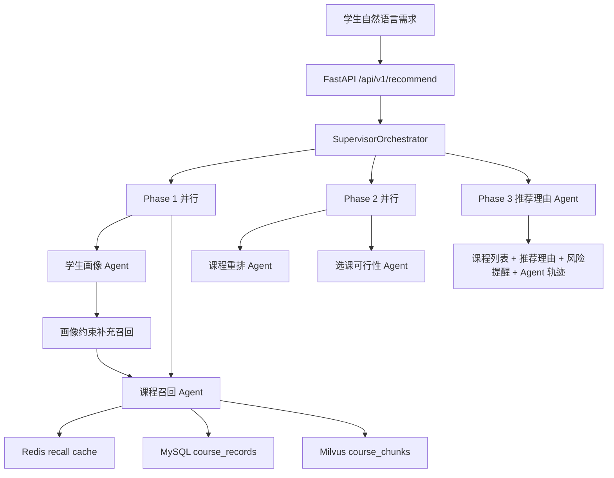

# 学校公选课 Multi-Agent 推荐系统

面向教务选课场景的 AI Agent 项目：学生用自然语言描述选课偏好，系统从真实公选课数据集中召回、排序、检查可选风险，并返回可解释的课程推荐。

这个仓库历史名称仍是 `multi-agent-ecommerce-system`，部分模型和环境变量也保留了电商阶段的兼容字段。但当前文档和 Python 主链路以“学校公选课推荐”为唯一主线。

## 项目解决什么问题

学生选公选课时，需求往往不是一个关键词能表达的。一个典型输入可能同时包含兴趣、校区、时间、考核方式、作业量、给分倾向和抢课风险：

```text
我想选一门不考试、作业少、给分友好的公选课，最好在东校区，周三晚上不要有课，
我对电影、心理学和艺术比较感兴趣，不想做小组作业。
```

普通搜索只能匹配课程名或标签，很难同时处理“不要考试”“给分友好”“避开某个时间段”“爆满但值得冲刺”这类混合约束。本项目把选课决策拆成多个 Agent，让每一步都有清晰输入、输出和可追踪结果。

最终响应会包含：

- 推荐课程列表
- 每门课的推荐理由
- 容量爆满、容量紧张、时间冲突、年级/专业/先修限制等风险提醒
- 每个 Agent 的执行结果和耗时，便于调试与面试讲解

## 核心能力


| 能力       | 实现方式                                            | 关键代码                                           |
| -------- | ----------------------------------------------- | ---------------------------------------------- |
| 自然语言画像抽取 | LLM 将 prompt 转为 `StudentProfile`                | `python/agents/student_profile_agent.py`       |
| 课程召回     | Redis 候选缓存 + MySQL 结构化筛选 + Milvus 课程 chunk 语义检索 | `python/agents/course_recall_agent.py`         |
| 个性化重排    | LLM 在候选课程 ID 内排序，解析失败回退规则排序                     | `python/agents/course_rerank_agent.py`         |
| 可行性检查    | 时间、容量、年级、专业、先修要求等规则判断                           | `python/agents/course_feasibility_agent.py`    |
| 推荐解释     | 基于课程字段和风险信息生成可执行建议                              | `python/agents/recommendation_reason_agent.py` |
| 编排与观测    | Supervisor 三阶段编排、Agent 耗时统计、实验分组                | `python/orchestrator/supervisor.py`            |


## 系统架构




主 API 使用 `python/orchestrator/supervisor.py`。同一条业务链路也提供了 `python/orchestrator/graph.py` 的 LangGraph 展示版本，对外接口是 `POST /api/v1/recommend/graph`。

## Agent 编排逻辑

`SupervisorOrchestrator.recommend()` 按三阶段执行：

1. Phase 1 并行运行学生画像 Agent 和课程召回 Agent。召回先基于原始 prompt 做宽召回；如果画像抽取成功，再根据领域、分类、校区等强约束补一次结构化召回。
2. Phase 2 并行运行课程重排 Agent 和选课可行性 Agent。前者决定推荐顺序，后者过滤硬冲突并生成容量、考试、小组作业等风险提醒。
3. Phase 3 串行运行推荐理由 Agent，因为解释必须基于最终课程列表和风险结果。

这种拆分不是为了堆概念，而是为了让“理解学生”“找课程”“排顺序”“查风险”“解释原因”分别可测试、可降级、可排查。

## 热点召回缓存

当多个学生同时询问相似需求时，例如“东校区、不考试、作业少、给分友好”，系统不需要每次都重新做 Milvus 向量检索和 MySQL 宽召回。`CourseRecallAgent` 会先根据结构化画像生成稳定 cache key，并尝试从 Redis 读取候选 `course_id` 列表。

命中缓存时：

```text
Redis course_id list
  -> MySQL fetch_courses_by_ids 回表拿最新课程
  -> 后续重排、可行性检查、推荐理由
```

未命中时：

```text
Redis SET lock NX EX
  -> 拿到短锁的请求执行 MySQL + Milvus 完整召回
  -> 写入候选 course_id list，默认 TTL 15 分钟
  -> 其他同 key 请求短暂等待后优先复用缓存
```

这里缓存的是“候选集索引”，不是完整课程对象；容量、已选人数、年级/专业限制等事实字段仍以 MySQL 回表结果为准。

## 数据层设计

已有课程 CSV：

`course_dataset_tools/output/public_elective_courses.csv`

导入脚本：

`python/scripts/ingest_course_dataset.py`

导入后形成两层数据：


| 层                           | 存储内容               | 作用                                                |
| --------------------------- | ------------------ | ------------------------------------------------- |
| MySQL `course_records`      | 每门课完整结构化字段和原始 JSON | 结构化过滤、回表展示、容量/限制判断                                |
| MySQL `course_chunks`       | 每门课拆分后的文本块内容和元数据   | 保存可追踪 chunk 文本                                    |
| Milvus `course_chunks_real` | chunk embedding    | 自然语言语义召回；实际名称以 `ECOM_COURSE_MILVUS_COLLECTION` 为准 |


每门课默认拆成 4 类 chunk：


| chunk 类型            | 覆盖字段                    | 适合命中的需求             |
| ------------------- | ----------------------- | ------------------- |
| `basic`             | 课程名、教师、学分、分类、领域         | “心理学”“艺术类”“某老师”     |
| `schedule_capacity` | 校区、上课时间、地点、容量、热度、抢课建议   | “东校区”“周三晚上不要”“别太难抢” |
| `learning_profile`  | 简介、考核、难度、作业量、给分、考试、小组作业 | “不考试”“作业少”“给分友好”    |
| `audience_tags`     | 年级、专业、先修、适合人群、标签、历史选课比例 | “适合低年级”“没有先修要求”     |


这样设计的原因是：整行 CSV 直接 embedding 会把时间、容量、学习体验和适合人群混在一起，语义命中不稳定；分块后可以让不同类型的需求命中更具体的课程片段，再通过 `course_id` 回 MySQL 拿完整记录。

## Docker 部署（公选课推荐：MySQL · Redis · Milvus · FastAPI）

本节描述如何用 Compose **一次性拉起公选课推荐依赖栈**：结构化课程数据在 **MySQL**、语义召回向量在 **Milvus**（底层依赖 **etcd + MinIO**）、热点召回缓存在 **Redis**，应用为 `**python/` 构建的 FastAPI 镜像**。编排文件为仓库根目录的 `[docker-compose.python.yml](docker-compose.python.yml)`。

> **与根目录 `docker-compose.yml` 的区别**：根文件主要面向历史 Java 微服务与前端的电商演示栈；**公选课 Multi-Agent 主链路以 `docker-compose.python.yml` + `python/` 为准**。

### 拓扑与服务职责

```text
python-api (FastAPI :8000)
    ├── MySQL (:3306)     course_records / course_chunks；结构化筛选与回表
    ├── Redis (:6379)      召回候选 course_id 列表缓存（短 TTL + 防击穿锁）
    └── Milvus (:19530)
            ├── etcd        Milvus 元数据（内部）
            └── MinIO       Milvus 对象存储（内部）
```


| 服务      | Compose 名称   | 宿主机端口（默认）            | 在公选课业务中的作用                                            |
| ------- | ------------ | -------------------- | ----------------------------------------------------- |
| FastAPI | `python-api` | `8000`               | `POST /api/v1/recommend` 主链路、`/health`、LangGraph 展示接口 |
| MySQL   | `mysql`      | `3306`               | 存 `course_records`、`course_chunks`；画像约束的结构化召回、容量与限制判断 |
| Redis   | `redis`      | `6379`               | 课程召回 Agent 的热点候选缓存与锁                                  |
| Milvus  | `milvus`     | `19530`（gRPC）、`9091` | 课程 chunk 向量检索，支撑自然语言语义召回                              |
| etcd    | `etcd`       | 不对外暴露                | Milvus standalone 依赖                                  |
| MinIO   | `minio`      | 不对外暴露                | Milvus standalone 依赖                                  |


镜像与入口：`[python/Dockerfile](python/Dockerfile)`（Python 3.12-slim，`uvicorn main:app`）。

### 前置条件

- 已安装 **Docker** 与 **Docker Compose V2**（`docker compose` 子命令可用）。
- 建议机器内存 **≥ 8GB**（Milvus standalone 与 MySQL 同机运行时有明显占用）。
- 公选课 CSV 位于 `course_dataset_tools/output/public_elective_courses.csv`（或通过 `--csv` 指定路径，见下文导入命令）。

### 1. 准备 `python/.env`（必选 LLM + 阿里云向量）

`docker-compose.python.yml` 中为 `python-api` 配置了 `env_file: ./python/.env`。**请将阿里云（或其他第三方）LLM Key、embedding 供应商与模型、`ECOM_COURSE_MILVUS_COLLECTION` / 向量维度等全部写入该文件**（不要将密钥提交到 Git）。Compose 仅在 `environment` 中覆盖 `**ECOM_MYSQL_*`、`ECOM_REDIS_URL`、`ECOM_MILVUS_HOST`、`ECOM_MILVUS_PORT`**，以保证容器内用服务名 `mysql` / `redis` / `milvus` 连依赖——**不会在 Compose 里再写死任何 collection**，避免盖住你在 `.env` 里配置的第三方向量与 collection。

当前公选课链路使用阿里云 LLM 与阿里云向量模型，`python/.env` 至少保持如下配置：

```env
# LLM Configuration
ECOM_LLM_API_KEY=你的阿里云API Key
ECOM_LLM_MODEL=deepseek-v4-pro
ECOM_LLM_BASE_URL=https://llm-oe8ejw5pgtze0knw.cn-beijing.maas.aliyuncs.com/compatible-mode/v1
ECOM_LLM_ENABLE_THINKING=true

# Embedding Configuration
ECOM_EMBEDDING_PROVIDER=dashscope_multimodal
ECOM_EMBEDDING_BASE_URL=https://llm-oe8ejw5pgtze0knw.cn-beijing.maas.aliyuncs.com/api/v1
ECOM_EMBEDDING_API_KEY=你的阿里云API Key
ECOM_EMBEDDING_MODEL=tongyi-embedding-vision-plus-2026-03-06
ECOM_EMBEDDING_DIMENSION=1152
ECOM_EMBEDDING_BATCH_SIZE=8
ECOM_EMBEDDING_TIMEOUT_SECONDS=30

# Milvus
ECOM_MILVUS_DIMENSION=1152
ECOM_COURSE_MILVUS_COLLECTION=course_chunks_real
```

说明：

- Compose 已为容器设置 `ECOM_MYSQL_*`、`ECOM_REDIS_URL`、`ECOM_MILVUS_HOST`、`ECOM_MILVUS_PORT`；一般无需在 `.env` 中再写 `localhost`。
- `**ECOM_COURSE_MILVUS_COLLECTION`（及可选的 `ECOM_MILVUS_COLLECTION`）完全由 `python/.env` 决定**，与入库脚本、Milvus 中已建 collection 保持一致即可；历史商品向量若仍用 `ECOM_MILVUS_COLLECTION=product_embeddings` 可自行在 `.env` 写明。
- 本项目推荐链路不要使用本地向量模型；`ECOM_EMBEDDING_PROVIDER` 应保持为 `dashscope_multimodal`，并确保 `ECOM_EMBEDDING_DIMENSION`、`ECOM_MILVUS_DIMENSION`、Milvus collection 已建维度都为 `1152`。

### 2. 构建并启动全栈

在**仓库根目录**执行：

```bash
docker compose -f docker-compose.python.yml --profile python up -d --build
```

若 **Docker Hub 拉镜像超时**，或报错里出现 `**registry-1.docker.io`**、`failed to resolve`、`Head ... manifests ... EOF`、连接超时等（多为到 Docker Hub 的网络不稳定或被阻断），可改用本仓库自带的 DaoCloud 公共代理覆盖文件（其中 `etcd` 仍直接使用 `quay.io`，因 DaoCloud 代理路径对 `etcd` 常返回 403）：

```bash
docker compose -f docker-compose.python.yml -f docker-compose.python.pull-mirror.yml --profile python up -d --build
```

首次拉取 Milvus/etcd/MinIO 镜像可能较慢。**MySQL 首次初始化可能需约 1～2 分钟**；若第一次 `up` 在等待健康检查时结束过早，`python-api` 仍可能停在 `Created`，再执行一次（一般无需 `--build`）：

```bash
docker compose -f docker-compose.python.yml --profile python up -d
```

Milvus `standalone` 往往需要 **30 秒～数分钟** 才就绪。查看日志：

```bash
docker compose -f docker-compose.python.yml logs -f milvus python-api
```

### 3. 健康检查

```bash
POST http://127.0.0.1:8000/api/v1/recommend
```

响应中除 `deps.mysql`、`deps.redis`、`deps.milvus` 外，还包含 `**llm` / `embedding_provider**` 摘要，便于确认进程实际使用的 LLM 域名与是否与灵积等平台一致。
重点检查：

```json
{
  "llm": {
    "model": "deepseek-v4-pro"
  },
  "embedding_provider": "dashscope_multimodal",
  "deps": {
    "mysql": true,
    "redis": true,
    "milvus": true
  }
}
```

### 4. 导入公选课数据（MySQL + Milvus）

应用在首次请求前 **不会自动导入 CSV**。需要在 MySQL 与 Milvus 可用后执行 `ingest_course_dataset.py`。

**方式 A：宿主机运行脚本（仓库根执行，连 `localhost` 映射端口）**

```bash
cd python
python -m pip install -r requirements.txt
python scripts/ingest_course_dataset.py --limit 20
python scripts/ingest_course_dataset.py
```

前提是宿主机已通过 Compose 暴露了 `3306`、`19530`，且环境与 `.env`/环境变量中的 `ECOM_*` 与容器侧一致。

**方式 B：进入运行中的 API 容器执行**

```bash
docker compose -f docker-compose.python.yml exec python-api \
  python scripts/ingest_course_dataset.py --limit 20
docker compose -f docker-compose.python.yml exec python-api \
  python scripts/ingest_course_dataset.py
```

导入完成后：`course_records`、`course_chunks` 写入 MySQL，向量写入 Milvus 中配置的 collection。

### 5. 验证推荐接口

推荐先用仓库内置 payload 测主链路。PowerShell：

```powershell
curl.exe -sS -X POST "http://127.0.0.1:8000/api/v1/recommend" `
  -H "Content-Type: application/json" `
  --data-binary "@python/scripts/curl_recommend_payload.json"
```

Linux/macOS：

```bash
curl -sS -X POST "http://127.0.0.1:8000/api/v1/recommend" \
  -H "Content-Type: application/json" \
  --data-binary "@python/scripts/curl_recommend_payload.json"
```

也可运行 `[python/scripts/post_recommend_local.py](python/scripts/post_recommend_local.py)`，脚本会先请求 `/health` 打印 LLM/embedding 诊断，再调用 `POST /api/v1/recommend`。

```bash
cd python
python scripts/post_recommend_local.py
```

如果要验证 LangGraph 展示链路，把路径换成 `/api/v1/recommend/graph` 即可。

### 6. 运行测试

普通单测不需要真实 LLM 调用：

```bash
cd python
python -m pytest
```

真实 LLM 冒烟测试需要显式打开开关，且会消耗阿里云调用额度：

```powershell
cd python
$env:ECOM_E2E_LLM="1"
python -m pytest tests/test_llm_integration_smoke.py -m integration -v
```

```bash
cd python
ECOM_E2E_LLM=1 python -m pytest tests/test_llm_integration_smoke.py -m integration -v
```

### 7. 常用运维命令

```bash
# 查看运行状态
docker compose -f docker-compose.python.yml --profile python ps

# 停止并删除容器（数据卷默认保留）
docker compose -f docker-compose.python.yml --profile python down

# 连同命名卷清空（会丢失 MySQL/Redis/Milvus 持久化数据，慎用）
docker compose -f docker-compose.python.yml --profile python down -v
```

数据库初始化：`mysql` 服务将 `[scripts/init-db.sql](scripts/init-db.sql)` 挂载到 `/docker-entrypoint-initdb.d/`，首次启动会创建 `ecommerce_ai` 及 `course_records`、`course_chunks` 等表结构。

---

## 快速运行

### 1. 安装依赖

```bash
cd python
python -m pip install -r requirements.txt
```

### 2. 配置环境变量

在 `**python/.env` 或仓库根 `.env**` 中配置阿里云 LLM 与阿里云 embedding（应用会从仓库根与 `python/` 两处尝试加载 `.env`，见 `[python/config/settings.py](python/config/settings.py)`）。当前代码保留 `ECOM_` 前缀，这是历史兼容设计，不代表当前业务仍是电商。

```env
ECOM_LLM_API_KEY=你的阿里云API Key
ECOM_LLM_BASE_URL=https://llm-oe8ejw5pgtze0knw.cn-beijing.maas.aliyuncs.com/compatible-mode/v1
ECOM_LLM_MODEL=deepseek-v4-pro
ECOM_LLM_ENABLE_THINKING=true

ECOM_EMBEDDING_PROVIDER=dashscope_multimodal
ECOM_EMBEDDING_BASE_URL=https://llm-oe8ejw5pgtze0knw.cn-beijing.maas.aliyuncs.com/api/v1
ECOM_EMBEDDING_API_KEY=你的阿里云API Key
ECOM_EMBEDDING_MODEL=tongyi-embedding-vision-plus-2026-03-06
ECOM_EMBEDDING_DIMENSION=1152
ECOM_MILVUS_DIMENSION=1152
ECOM_COURSE_MILVUS_COLLECTION=course_chunks_real
```

如果用 Docker 跑 `python-api`，必须保证 `python/.env` 有这些变量；根目录 `.env` 不会被 Compose 自动注入。`ECOM_EMBEDDING_DIMENSION`、`ECOM_MILVUS_DIMENSION` 和已存在的 Milvus collection 维度必须一致。

### 3. 启动依赖服务（本机开发与 Docker 相同 Compose）

不使用 API 镜像、只在本地跑 `uvicorn` 时，同样需要 MySQL / Redis / Milvus：

```bash
docker compose -f docker-compose.python.yml --profile python up -d --build
```

若已按上文 **Docker 全栈** 部署，则本步可跳过，直接对已暴露的端口启动本地 `python` 进程即可。

### 4. 导入课程数据

建议先导入少量数据验证链路，再导入完整 CSV：

```bash
cd python
python scripts/ingest_course_dataset.py --limit 20
python scripts/ingest_course_dataset.py
```

脚本会完成：

1. 读取 `course_dataset_tools/output/public_elective_courses.csv`
2. 写入 MySQL `course_records`
3. 生成 `basic`、`schedule_capacity`、`learning_profile`、`audience_tags` 四类 chunk
4. 写入 MySQL `course_chunks`
5. 生成 embedding 并写入 Milvus

### 5. 启动 API（本机进程，不用 `python-api` 容器时）

```bash
cd python
uvicorn main:app --host 0.0.0.0 --port 8000
```

若使用 Docker 部署且已包含 `python-api` 容器，则由容器内 `uvicorn` 监听 `8000`，无需再手动执行本段。

### 6. 健康检查

```bash
curl http://localhost:8000/health
```

`/health` 会检查 MySQL、Redis、Milvus 是否可达，并返回实际 LLM 和 embedding provider。Redis 当前用于课程召回候选 `course_id` 列表缓存，并保留历史 Feature Store 封装；学生画像仍主要来自当次 prompt 和 context。

## 推荐接口示例

Windows PowerShell：

```powershell
curl.exe -X POST "http://localhost:8000/api/v1/recommend" `
  -H "Content-Type: application/json" `
  -d "{\"user_id\":\"S10001\",\"num_items\":5,\"prompt\":\"想选不考试、作业少、给分友好的艺术类公选课，东校区优先，周三晚上不要有课\",\"context\":{\"avoid_time_slots\":[\"周三第9-10节\"],\"campus\":[\"东校区\"]}}"
```

Linux/macOS：

```bash
curl -X POST "http://localhost:8000/api/v1/recommend" \
  -H "Content-Type: application/json" \
  -d '{"user_id":"S10001","num_items":5,"prompt":"想选不考试、作业少、给分友好的艺术类公选课，东校区优先，周三晚上不要有课","context":{"avoid_time_slots":["周三第9-10节"],"campus":["东校区"]}}'
```

响应结构示例：

```json
{
  "request_id": "7d6d...",
  "user_id": "S10001",
  "courses": [
    {
      "course_id": "GXK2026003",
      "course_name": "风景地貌学",
      "teacher": "杨雪强",
      "domain": "自然环境",
      "campus": "东校区",
      "time_slot": "周四第7-8节",
      "has_exam": "否",
      "workload": "中",
      "grade_friendly": "中"
    }
  ],
  "recommendation_reasons": [
    {
      "course_id": "GXK2026003",
      "reason": "课程位于东校区且不考试，内容偏自然环境拓展，适合希望用公选课拓宽知识面的学生；但当前热度较高，建议提前抢课。"
    }
  ],
  "selection_warnings": [
    {
      "course_id": "GXK2026003",
      "level": "high",
      "type": "capacity_full",
      "message": "当前已选人数达到或超过容量，建议作为冲刺志愿并准备替代课程。"
    }
  ],
  "experiment_group": "control",
  "total_latency_ms": 1530.2
}
```

## API 清单


| 方法     | 路径                                            | 说明                    |
| ------ | --------------------------------------------- | --------------------- |
| `POST` | `/api/v1/recommend`                           | Supervisor 主链路课程推荐    |
| `POST` | `/api/v1/recommend/graph`                     | LangGraph 状态图展示链路     |
| `GET`  | `/api/v1/experiments`                         | 查看进程内 A/B 实验状态        |
| `POST` | `/api/v1/experiments/{experiment_id}/outcome` | 记录实验结果                |
| `GET`  | `/api/v1/metrics`                             | 查看进程内 Agent 与业务指标     |
| `GET`  | `/health`                                     | 检查 MySQL、Redis、Milvus |


## 项目结构

```text
multi-agent-ecommerce-system/
├── README.md
├── docker-compose.python.yml
├── docker-compose.python.pull-mirror.yml
├── course_dataset_tools/
│   └── output/public_elective_courses.csv
├── docs/
│   ├── architecture.md
│   ├── code-walkthrough.md
│   ├── interview-guide.md
│   ├── resume-template.md
│   └── plans/2026-05-11-course-agent-redesign.md
├── python/
│   ├── main.py
│   ├── config/settings.py
│   ├── models/schemas.py
│   ├── orchestrator/
│   │   ├── supervisor.py
│   │   └── graph.py
│   ├── agents/
│   │   ├── base_agent.py
│   │   ├── student_profile_agent.py
│   │   ├── course_recall_agent.py
│   │   ├── course_rerank_agent.py
│   │   ├── course_feasibility_agent.py
│   │   └── recommendation_reason_agent.py
│   ├── repositories/
│   │   ├── course_repository.py
│   │   ├── course_recall_cache_repository.py
│   │   ├── course_vector_repository.py
│   │   ├── mysql_repository.py
│   │   └── redis_repository.py
│   └── scripts/ingest_course_dataset.py
└── scripts/init-db.sql
```

仓库中仍保留 Java、Go、前端和根 `docker-compose.yml` 等历史/对照内容。当前公选课主推荐链路以 `python/` 和 `docker-compose.python.yml` 为准。

## 常见问题与排障

### Docker 拉镜像失败（`registry-1.docker.io` / `EOF`）

若 `docker compose up` 在拉取 `docker.io/library/*` 等镜像时报 `failed to resolve` 或 `Head ... EOF`，优先使用镜像加速：

```bash
docker compose -f docker-compose.python.yml -f docker-compose.python.pull-mirror.yml --profile python pull
docker compose -f docker-compose.python.yml -f docker-compose.python.pull-mirror.yml --profile python up -d --build
```

也可在 Docker Desktop 配置 `registry-mirrors` 后重试仅主文件的 compose。

### MySQL 或 Milvus 未就绪

先启动依赖服务：

```bash
docker compose -f docker-compose.python.yml --profile python up -d --build
```

再访问 `GET /health`。如果 Milvus 仍不可用，先确认端口 `19530`、collection 名和 embedding 维度。

### embedding 维度不一致

`ECOM_EMBEDDING_DIMENSION`、`ECOM_MILVUS_DIMENSION`、Milvus collection 已存在维度必须一致。如果你之前用旧维度写入过数据，建议清空对应 collection 后重新导入。

### 课程 collection 名称不一致

课程 chunk 向量使用的 collection **以 `python/.env` 中 `ECOM_COURSE_MILVUS_COLLECTION` 为准**（Docker Compose 不再覆盖该项）。务必与入库脚本写入的 collection 名一致；`ECOM_MILVUS_COLLECTION` 若为 `product_embeddings`，仅作用于历史商品向量路径，不是公选课语义召回。

### Redis 缓存命中但课程状态变化

Redis 只缓存候选 `course_id` 列表，不缓存完整课程对象。命中后仍会调用 MySQL 回表，因此容量、已选人数、限制条件会使用最新数据。如果缓存 ID 回表为空，召回链路会忽略缓存并回退完整 MySQL + Milvus 召回。

### LLM 输出不是合法 JSON

画像、重排和推荐理由 Agent 都要求 LLM 输出 JSON。当前代码做了 Markdown 代码块清理和解析失败回退：画像失败走启发式画像，重排失败走规则排序，推荐理由失败走字段拼接。

### 为什么最终课程少于 `num_items`

选课可行性 Agent 会过滤硬冲突课程，例如时间命中 `avoid_time_slots`、年级/专业限制不匹配、缺少先修要求。过滤后可用课程不足时，最终列表会少于请求数量。

## 面试亮点

- **场景不是套壳 RAG**：系统不只是检索课程后回答，而是要完成召回、排序、风险判断和可解释决策。
- **Multi-Agent 拆分有依赖依据**：画像和宽召回可并行，重排和可行性检查可并行，推荐理由依赖最终结果所以串行。
- **结构化数据与语义检索结合**：MySQL 负责精确字段和回表，Milvus 负责自然语言语义召回。
- **热点召回缓存**：Redis 缓存结构化画像对应的候选 `course_id` 列表，用短锁防止同类并发请求击穿召回层。
- **降低 LLM 幻觉**：LLM 重排只能输出候选课程 ID，推荐理由只能基于输入字段生成，最终课程来自 MySQL。
- **真实数据闭环**：从公选课 CSV 到 MySQL/Milvus，再到 FastAPI 推荐接口，能完整演示。
- **边界诚实**：Redis 已接入召回候选缓存，但不是实时学生画像来源；A/B、metrics 仍是轻量进程内框架。

## 简历写法

```text
学校公选课 Multi-Agent 推荐系统 | 个人项目 | 2026.05
• 设计并实现面向教务系统的公选课推荐 Agent 系统，支持学生用自然语言描述兴趣、时间、校区、考核方式和学习负担偏好
• 采用 Supervisor 模式编排学生画像、课程召回、课程重排、选课可行性和推荐理由 5 个 Agent，将选课决策拆成可追踪、可降级的阶段
• 基于 MySQL + Milvus 构建课程 RAG 数据层，将公选课 CSV 拆分为 basic、schedule_capacity、learning_profile、audience_tags 四类语义 chunk
• 在召回阶段结合结构化筛选与向量检索，在重排阶段约束 LLM 只从候选课程 ID 中排序，降低推荐不存在课程的风险
• 使用 Redis 缓存结构化画像对应的候选 course_id 列表，命中后回 MySQL 获取最新课程状态，减少热点需求重复召回
• 实现容量爆满、时间冲突、年级/专业/先修限制等选课风险判断，输出推荐理由和抢课建议

技术栈：FastAPI · LangGraph · Multi-Agent · Milvus · MySQL · Redis · Docker · OpenAI-Compatible LLM
```

## 相关文档

- `docs/architecture.md`：系统架构与数据流
- `docs/code-walkthrough.md`：逐文件代码讲解
- `docs/interview-guide.md`：面试问答与项目讲法
- `docs/resume-template.md`：简历与 STAR 包装
- `docs/plans/2026-05-11-course-agent-redesign.md`：课程场景改造设计记录

