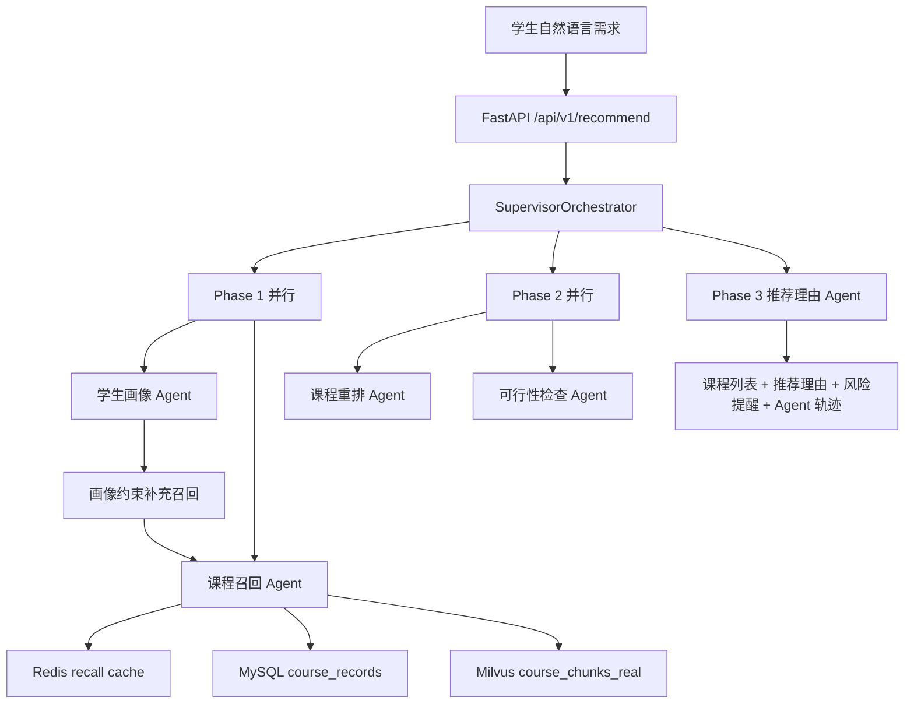

# 学校公选课 Multi-Agent 推荐系统

面向教务选课场景的 AI Agent 项目。学生用自然语言描述选课偏好，系统从真实公选课数据集中召回课程、排序、检查选课风险，并返回可解释的推荐结果。

仓库历史名称仍是 `multi-agent-ecommerce-system`，部分环境变量也保留 `ECOM_` 前缀用于兼容；当前 Python 主链路以“学校公选课推荐”为准。

## 快速启动

以下步骤默认在仓库根目录执行，主编排文件是 `docker-compose.python.yml`。

### 1. 准备 Python 环境

Windows PowerShell：

```powershell
python -m venv .venv
.\.venv\Scripts\Activate.ps1
python -m pip install -r .\python\requirements.txt
```

Linux/macOS：

```bash
python -m venv .venv
source .venv/bin/activate
python -m pip install -r ./python/requirements.txt
```

### 2. 配置 LLM 和向量模型

创建或修改 `python/.env`。Docker 启动 `python-api` 时会读取这个文件。

```env
ECOM_LLM_API_KEY=你的阿里云API Key
ECOM_LLM_BASE_URL=https://llm-oe8ejw5pgtze0knw.cn-beijing.maas.aliyuncs.com/compatible-mode/v1
ECOM_LLM_MODEL=deepseek-v4-pro
ECOM_LLM_ENABLE_THINKING=true

ECOM_EMBEDDING_PROVIDER=dashscope_multimodal
ECOM_EMBEDDING_BASE_URL=https://llm-oe8ejw5pgtze0knw.cn-beijing.maas.aliyuncs.com/api/v1
ECOM_EMBEDDING_API_KEY=你的阿里云API Key
ECOM_EMBEDDING_MODEL=tongyi-embedding-vision-plus-2026-03-06
ECOM_EMBEDDING_DIMENSION=1152
ECOM_MILVUS_DIMENSION=1152
ECOM_COURSE_MILVUS_COLLECTION=course_chunks_real
```

MySQL、Redis、Milvus 的容器网络地址已在 `docker-compose.python.yml` 中覆盖，通常不用写进 `.env`。

### 3. 启动 Docker 服务

第一次启动，或改过 `python/Dockerfile`、`python/requirements.txt` 这类镜像构建文件时：

```bash
docker compose -f docker-compose.python.yml --profile python up -d --build
```

后续镜像和容器已存在，只是正常启动或更新 compose 环境变量时：

```bash
docker compose -f docker-compose.python.yml --profile python up -d
```

查看状态：

```bash
docker compose -f docker-compose.python.yml --profile python ps
```

### 4. 导入课程数据

先少量验证，再导入完整数据：

```bash
cd python
python scripts/ingest_course_dataset.py --limit 20
python scripts/ingest_course_dataset.py
cd ..
```

脚本会读取 `course_dataset_tools/output/public_elective_courses.csv`，写入 MySQL，并把课程 chunk 向量写入 Milvus。

### 5. 简单测试

健康检查：

```bash
curl http://localhost:8000/health
```

Windows PowerShell 推荐接口测试：

```powershell
curl.exe -sS -X POST "http://localhost:8000/api/v1/recommend" `
  -H "Content-Type: application/json" `
  --data-binary "@python/scripts/curl_recommend_payload.json"
```

Linux/macOS：

```bash
curl -sS -X POST "http://localhost:8000/api/v1/recommend" \
  -H "Content-Type: application/json" \
  --data-binary "@python/scripts/curl_recommend_payload.json"
```

示例 payload 位于 `python/scripts/curl_recommend_payload.json`：

```json
{
  "user_id": "curl_test_user",
  "scene": "course_selection",
  "num_items": 3,
  "prompt": "想找不考试、作业少的人文艺术公选课，东校区优先",
  "context": {
    "avoid_time_slots": ["周三第9-10节"]
  }
}
```

## 项目解决什么问题

学生选公选课时，需求通常不是一个关键词能表达的。一次请求可能同时包含：

- 兴趣方向：电影、心理学、艺术、人文、自然科学等
- 时间限制：周三晚上不要有课
- 校区偏好：东校区优先
- 考核偏好：不考试、作业少、不要小组作业
- 选课风险：容量爆满、容量紧张、专业/年级/先修限制

普通搜索只能匹配课程名或标签，很难同时处理这些混合约束。本项目把选课决策拆成多个 Agent，让“理解学生、找课程、排顺序、查风险、解释原因”分别可追踪、可测试、可降级。

最终响应包含：

- 推荐课程列表
- 每门课的推荐理由
- 容量、时间冲突、年级/专业/先修限制等风险提醒
- Agent 执行轨迹和耗时

## 核心能力

| 能力 | 实现方式 | 关键代码 |
| --- | --- | --- |
| 学生画像抽取 | LLM 将自然语言 prompt 转为 `StudentProfile` | `python/agents/student_profile_agent.py` |
| 课程召回 | Redis 候选缓存 + MySQL 结构化筛选 + Milvus 语义检索 | `python/agents/course_recall_agent.py` |
| 课程重排 | LLM 在候选课程 ID 内排序，失败时回退规则排序 | `python/agents/course_rerank_agent.py` |
| 可行性检查 | 用规则判断时间、容量、年级、专业、先修等风险 | `python/agents/course_feasibility_agent.py` |
| 推荐解释 | 基于课程字段和风险结果生成可执行建议 | `python/agents/recommendation_reason_agent.py` |
| 编排与观测 | Supervisor 三阶段编排，记录 Agent 结果和耗时 | `python/orchestrator/supervisor.py` |

## Agent 编排



执行顺序：

1. Phase 1：学生画像 Agent 和课程召回 Agent 并行。画像成功后，根据领域、分类、校区等约束补一次结构化召回。
2. Phase 2：课程重排 Agent 和可行性检查 Agent 并行。重排决定推荐顺序，可行性检查产出容量、时间、限制等风险。
3. Phase 3：推荐理由 Agent 串行执行，因为解释必须基于最终课程和风险结果。

## 数据库与向量检索

课程数据源：

```text
course_dataset_tools/output/public_elective_courses.csv
```

导入脚本：

```text
python/scripts/ingest_course_dataset.py
```

导入后形成两层数据：

| 存储 | 内容 | 作用 |
| --- | --- | --- |
| MySQL `course_records` | 每门课完整结构化字段和原始 JSON | 结构化筛选、回表展示、容量和限制判断 |
| MySQL `course_chunks` | 每门课拆分后的 chunk 文本和元数据 | 保存可追踪的 chunk 内容 |
| Milvus `course_chunks_real` | chunk embedding | 支撑自然语言语义召回 |

每门课默认拆成 4 类 chunk：

| chunk 类型 | 覆盖字段 | 适合命中的需求 |
| --- | --- | --- |
| `basic` | 课程名、教师、学分、分类、领域 | “心理学”“艺术类”“某老师” |
| `schedule_capacity` | 校区、上课时间、地点、容量、热度 | “东校区”“周三晚上不要”“别太难抢” |
| `learning_profile` | 简介、考核、难度、作业量、给分、考试、小组作业 | “不考试”“作业少”“给分友好” |
| `audience_tags` | 年级、专业、先修、适合人群、标签 | “适合低年级”“没有先修要求” |

这样做是为了避免整行 CSV 直接 embedding 后把时间、容量、学习体验和适合人群混在一起。分块后，不同类型的学生需求能命中更具体的课程片段，再通过 `course_id` 回 MySQL 拿完整记录。

## Redis 缓存

Redis 当前用于课程召回候选缓存，不缓存完整课程对象。

命中缓存：

```text
Redis course_id list
  -> MySQL fetch_courses_by_ids 回表拿最新课程
  -> 后续重排、可行性检查、推荐理由
```

未命中缓存：

```text
Redis SET lock NX EX
  -> 拿到短锁的请求执行 MySQL + Milvus 完整召回
  -> 写入候选 course_id list，默认 TTL 15 分钟
  -> 其他同 key 请求短暂等待后优先复用缓存
```

这样可以减少“东校区、不考试、作业少、给分友好”这类热点需求的重复召回，同时保证容量、已选人数、年级/专业限制等事实字段始终以 MySQL 回表结果为准。

## Docker 服务

`docker-compose.python.yml` 会启动：

| 服务 | 端口 | 作用 |
| --- | --- | --- |
| `python-api` | `8000` | FastAPI 推荐接口、`/health` |
| `mysql` | `3306` | 课程结构化数据和 chunk 元数据 |
| `redis` | `6379` | 课程召回热点缓存 |
| `milvus` | `19530`、`9091` | 课程 chunk 向量检索 |
| `etcd` | 内部 | Milvus 元数据依赖 |
| `minio` | 内部 | Milvus 对象存储依赖 |

常用命令：

```bash
# 查看状态
docker compose -f docker-compose.python.yml --profile python ps

# 后续启动或更新已有容器
docker compose -f docker-compose.python.yml --profile python up -d

# 重启已有容器
docker compose -f docker-compose.python.yml --profile python restart

# 停止并删除容器，数据卷默认保留
docker compose -f docker-compose.python.yml --profile python down
```

如果 Docker Hub 拉镜像超时，可使用镜像代理覆盖文件：

```bash
docker compose -f docker-compose.python.yml -f docker-compose.python.pull-mirror.yml --profile python up -d --build
```

## API 清单

| 方法 | 路径 | 说明 |
| --- | --- | --- |
| `POST` | `/api/v1/recommend` | Supervisor 主链路课程推荐 |
| `POST` | `/api/v1/recommend/graph` | LangGraph 状态图展示链路 |
| `GET` | `/api/v1/experiments` | 查看进程内实验状态 |
| `POST` | `/api/v1/experiments/{experiment_id}/outcome` | 记录实验结果 |
| `GET` | `/api/v1/metrics` | 查看 Agent 与业务指标 |
| `GET` | `/health` | 检查 MySQL、Redis、Milvus、LLM 和 embedding 配置 |

## 项目结构

```text
multi-agent-ecommerce-system/
├── README.md
├── docker-compose.python.yml
├── docker-compose.python.pull-mirror.yml
├── course_dataset_tools/
│   └── output/public_elective_courses.csv
├── python/
│   ├── main.py
│   ├── config/settings.py
│   ├── models/schemas.py
│   ├── orchestrator/
│   │   ├── supervisor.py
│   │   └── graph.py
│   ├── agents/
│   │   ├── student_profile_agent.py
│   │   ├── course_recall_agent.py
│   │   ├── course_rerank_agent.py
│   │   ├── course_feasibility_agent.py
│   │   └── recommendation_reason_agent.py
│   ├── repositories/
│   │   ├── course_repository.py
│   │   ├── course_recall_cache_repository.py
│   │   ├── course_vector_repository.py
│   │   ├── mysql_repository.py
│   │   └── redis_repository.py
│   └── scripts/
│       ├── ingest_course_dataset.py
│       └── curl_recommend_payload.json
├── scripts/
│   └── init-db.sql
└── docs/
    ├── architecture.md
    ├── code-walkthrough.md
    ├── interview-guide.md
    ├── project-plan.md
    └── resume-template.md
```

根目录 `docker-compose.yml`、Java、Go、前端等内容属于历史或对照栈；当前公选课主推荐链路以 `python/` 和 `docker-compose.python.yml` 为准。

## 常见问题

### MySQL 或 Milvus 未就绪

先看容器状态：

```bash
docker compose -f docker-compose.python.yml --profile python ps
```

再看日志：

```bash
docker compose -f docker-compose.python.yml --profile python logs --tail=80 mysql milvus python-api
```

MySQL 首次初始化通常需要一点时间；Milvus standalone 也可能需要几十秒到数分钟。

### embedding 维度不一致

`ECOM_EMBEDDING_DIMENSION`、`ECOM_MILVUS_DIMENSION`、Milvus collection 已存在维度必须一致。当前推荐配置是 `1152`。如果旧 collection 用过其他维度，需要清空或换新 collection 后重新导入。

### LLM 输出不是合法 JSON

画像、重排和推荐理由 Agent 都要求 LLM 输出 JSON。当前代码做了清理和回退：画像失败走启发式画像，重排失败走规则排序，推荐理由失败走字段拼接。

### 推荐课程少于 `num_items`

可行性检查会过滤硬冲突课程，例如时间冲突、年级/专业限制不匹配、缺少先修要求。过滤后可用课程不足时，最终列表可能少于请求数量。

## 相关文档

- `docs/architecture.md`：系统架构与数据流
- `docs/code-walkthrough.md`：逐文件代码讲解
- `docs/interview-guide.md`：面试问答与项目讲法
- `docs/resume-template.md`：简历与 STAR 包装
- `docs/plans/2026-05-11-course-agent-redesign.md`：课程场景改造设计记录
