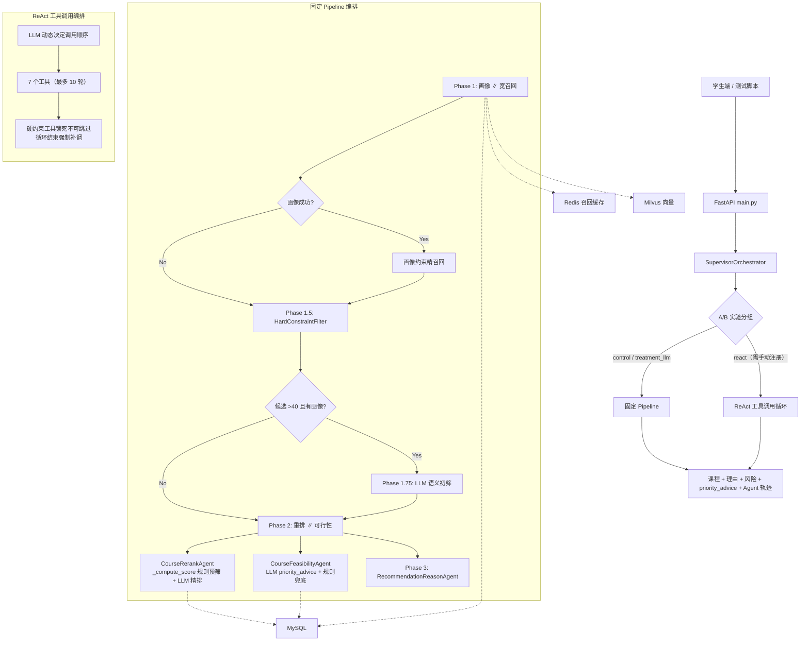
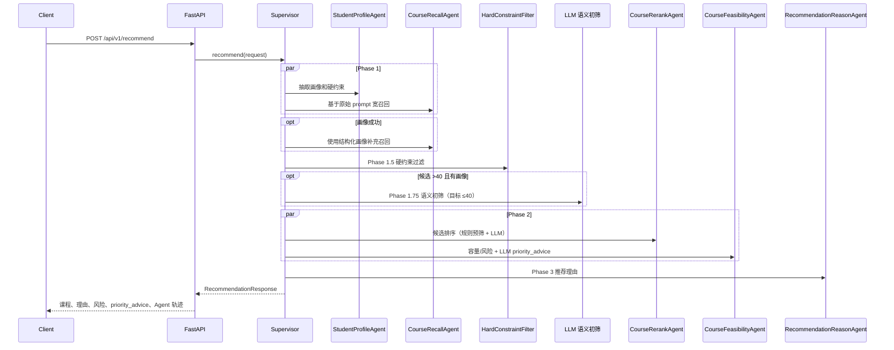

<!-- markdownlint-disable MD013 MD033 -->

# 大学校园多智能体平台——架构设计文档

学生用自然语言描述选课偏好，系统从 500 门公选课中召回、排序、检查选课风险并返回推荐。项目从电商推荐系统演变而来，但当前主链路已完全面向校园公选课场景。

## 1. 业务问题

每学期选课时，学生面临三类核心困难：

1. **信息过载**：500 门公选课散落在教务系统，无法快速找到感兴趣且适合自己的课。
2. **隐性约束难以判断**：校区、考核方式、时间冲突、年级优先权等硬约束，学生容易忽略。
3. **抢课风险不透明**：爆满课的年级优先权规则、选课容量趋势，学生看不到也算不清。

我的方案：把推荐拆成 5 个 Agent + 1 个确定性过滤器 + 1 个编排器，每个环节解决一个子问题，失败有兜底，不让 LLM 自由编造课程。

## 2. 系统边界

| 边界 | 当前职责 | 关键文件 |
| --- | --- | --- |
| API 层 | 推荐、流式推荐、LangGraph 展示、实验状态、指标、健康检查 | `python/main.py` |
| 编排层 | 调度画像、召回、硬约束、语义初筛、重排、可行性、理由生成；支持 Pipeline/ReAct 双模式 | `python/orchestrator/supervisor.py` |
| Agent 层 | 学生画像、课程召回、课程重排、选课可行性、推荐理由 | `python/agents/` |
| 约束层 | 对校区、类别、考试、教师、时间等硬条件做确定性过滤 | `python/orchestrator/hard_constraint_filter.py` |
| 数据访问层 | MySQL 课程事实、Milvus chunk 向量、Redis 召回缓存（含语义缓存） | `python/repositories/` |
| 数据导入 | 从公选课 CSV 构建 MySQL + Milvus 数据闭环 | `python/scripts/ingest_course_dataset.py` |

## 3. 总体架构

面试讲法：

> 我把 LLM 放在适合它的位置：理解自然语言、候选排序、生成解释和抢课建议。课程事实、硬约束和最终结果都由数据库和规则兜底，不让 LLM 自由编造课程。A/B 分组让我可以在同一套代码里对比不同编排策略的效果。

## 4. 请求链路

### 4.1 输入模型

`RecommendationRequest` 的关键字段：

| 字段 | 作用 |
| --- | --- |
| `user_id` | 学生标识，也用于进程内 A/B 实验分组 |
| `prompt` | 学生自然语言选课需求 |
| `query` | 兼容字段，`prompt` 为空时使用 |
| `context` | 结构化上下文，例如年级、专业、避开时间 |
| `num_items` | 期望返回课程数 |

`SupervisorOrchestrator._request_prompt()` 按 `prompt -> query -> context["query"]` 的顺序取实际输入。

### 4.2 固定 Pipeline 编排

设计取舍：

- **Phase 1 并行**：画像和宽召回都可以基于原始请求开始，减少等待。
- **画像后补召回**：如果画像抽到领域、类别、校区等结构化字段，再补一次召回，避免宽召回漏掉强约束课程。
- **Phase 1.5 硬约束**：明确条件先过滤，再让重排处理软偏好，避免违规课程被 LLM 排回结果。
- **Phase 1.75 语义初筛**：候选超过 40 门时用 LLM 缩减候选池，减少 Rerank 的 token 消耗。失败时保留原候选，靠 Rerank 的 `_compute_score` 规则预筛兜底。
- **Phase 2 并行**：重排决定顺序，可行性输出容量和风险，两者都依赖候选池但互不依赖。
- **Phase 3 串行**：推荐理由依赖最终课程和风险提醒，必须最后执行。

## 5. 双模式编排

我做了两种编排模式，用 A/B 实验分流。核心目的是对比"固定流程"和"LLM 自主决策"两种方案的推荐质量。

| 模式 | 触发方式 | 特点 |
| --- | --- | --- |
| 固定 Pipeline | A/B group = `control` 或 `treatment_llm` | 阶段固定、延迟可预测、各阶段失败独立降级 |
| ReAct 工具调用 | A/B group = `react`（当前未注册，需在 `services/ab_test.py:48` 手动添加） | LLM 动态决策调用顺序、可回头重试、最多 10 轮 |

### ReAct 模式的 7 个工具

| 工具 | 对应 Agent / 组件 | 备注 |
| --- | --- | --- |
| `extract_profile` | StudentProfileAgent | 首先调用 |
| `search_courses` | CourseRecallAgent | 参数 strategy: wide / refined |
| `filter_hard_constraints` | HardConstraintFilter | **锁死不可跳过** |
| `semantic_filter_courses` | LLM 语义初筛 | 可选 |
| `rerank_courses` | CourseRerankAgent | 指定返回数量 |
| `check_feasibility` | CourseFeasibilityAgent | 容量和风险 |
| `generate_reasons` | RecommendationReasonAgent | 最后调用 |

**关键约束**：如果 LLM 在 10 轮循环中跳过了 `filter_hard_constraints`，编排器在循环结束时强制补调。硬约束工具锁死不可跳过——校区和考试要求不允许概率性判断。

面试讲法：

> 我的编排器支持两种模式。固定 Pipeline 延迟可控，适合大部分请求。ReAct 模式让 LLM 动态决定执行步骤，在召回不足或全爆满时可以回头放宽条件重试。硬约束过滤锁死在工具链中不可跳过——校区和考试要求不允许概率性判断。

## 6. Agent 职责矩阵

| Agent / 组件 | 输入 | 输出 | 失败处理 |
| --- | --- | --- | --- |
| `StudentProfileAgent` | `user_id`、`prompt`、`context` | 学生画像（含 `grade` / `department`）、硬约束 | LLM JSON 失败时走关键词启发式 `_heuristic_profile()` |
| `CourseRecallAgent` | 画像、prompt、context、数量 | 候选课程列表、召回策略 | Redis/Milvus 失败时回退 MySQL 结构化查询；无数据时 mock 兜底 |
| `HardConstraintFilter` | 候选课程、硬约束 | 过滤后课程、过滤原因、warning | 候选不足时给 `hard_constraint_sparse` warning，不自动放宽 |
| `CourseRerankAgent` | 学生画像、候选课程 | 排序后课程 | LLM 排序失败时走规则排序（`_compute_score` 融合 Milvus COSINE + profile 偏好） |
| `CourseFeasibilityAgent` | 学生画像、候选课程 | 容量/爆满/小组作业风险 + `priority_advice` | LLM 生成抢课建议（最多送 12 门），失败静默回退规则路径 |
| `RecommendationReasonAgent` | 最终课程、画像、风险 | 推荐理由 | LLM 失败时用课程字段拼接理由 |

所有 Agent 继承 `BaseAgent`，统一处理耗时、重试、错误计数和 fallback。

`CourseFeasibilityAgent` 的 `priority_advice` 输出类型为 `dict[str, PriorityAdvice{advice, priority}]`，已在 `RecommendationResponse` 顶层透传，前端直接渲染抢课建议。

## 7. 评分职责分离

5/23 的重大改动：我把召回和重排的评分逻辑做了分离。之前两个阶段都在算 profile 匹配分，逻辑重复且不好调。

### 召回阶段 `_score_candidates()`

只保留三个因素，负责广度：

- Milvus 语义课程的初始分从 COSINE 距离初始化：`max(0.0, 1.0 - distance)`
- query 关键词匹配：每命中一个 term +1.5
- 热度加成：`popularity_level >= 3` 则 +0.8

**关键设计**：`_score_candidates` 接受 `profile` 参数但不用——不是 bug，召回阶段负责广度，精排评分由 RerankAgent 负责。

### 重排阶段 `_compute_score()`

做完整的 profile 偏好匹配，负责精度：

| 维度 | 加/减分 | 条件 |
| --- | --- | --- |
| domain 匹配 | +4.0 | `course.domain in profile.preferred_domains` |
| category 匹配 | +3.0 | `course.course_category in profile.preferred_categories` |
| campus 匹配 | +2.0 | `course.campus in profile.preferred_campus` |
| 作业少 | +1.5 | `workload_preference == "少"` 且课程 workload 低 |
| 不考试 | +1.5 | `exam_preference == "不考试"` 且 `has_exam == 0` |
| 给分友好 | +1.2 | `grade_friendly_preference == "高"` 且课程给分中高 |
| 无考试（通用） | +0.5 | 无论 profile 如何，`has_exam == 0` |
| 低工作量（通用） | +0.5 | 无论 profile 如何，workload 低 |
| 热门加成 | +0.8 | `popularity_level >= 3` |
| 爆满惩罚 | -0.4 | `popularity_level >= 4` |
| 低年级爆满课惩罚 | -2.0 | 大一/大二选 `popularity_level >= 4` 的课 |

最终公式：`final = profile_score * (1.0 + milvus_sim * 0.5)`

面试讲法：

> 我把评分逻辑做了分离。召回阶段只保留关键词匹配和热度，负责广度；重排阶段才融入 profile 偏好和 Milvus COSINE 距离，负责精度。这样避免了两阶段评分逻辑重复，也让 Milvus 的向量相似度真正参与排序，而不是只用来决定召不召回。

## 8. 数据架构

### 8.1 MySQL：课程事实源

`course_records` 保存课程主字段和 `raw_json`。`raw_json` 用于回表时补齐字段，避免表结构每次跟着 CSV 字段大改。

`course_chunks` 保存每门课的文本片段：

| chunk 类型 | 主要内容 | 解决的问题 |
| --- | --- | --- |
| `basic` | 课程名、教师、学分、类型、分类、领域 | "这是什么课" |
| `schedule_capacity` | 校区、时间、地点、容量、热度 | "能不能选、难不难抢" |
| `learning_profile` | 简介、考核、难度、作业、考试、小组作业 | "学起来轻不轻松" |
| `audience_tags` | 年级/专业/先修、适合人群、标签 | "适不适合这个学生" |

### 8.2 Milvus：语义召回

Milvus collection `course_chunks_real`，向量维度 1024，每门课 4 条 chunk，共 2000 条向量。检索时把用户 query 转成向量，命中 chunk 后解析 `course_id`，再回 MySQL 拿完整课程。

设计取舍：

- 不把整门课合成一个向量——避免字段语义互相稀释。
- 不让 Milvus 承担事实判断——向量片段无法判断容量、时间和限制条件。

### 8.3 Redis：召回缓存与语义缓存

Redis 缓存的是候选 `course_id` 列表，不是完整 `Course` 对象。

| key 类型 | value | 目的 |
| --- | --- | --- |
| `recall:v1:<hash>` | JSON course_id list | 复用结构化画像召回结果 |
| `recall:v1:<hash>:lock` | 短锁标记 | 降低同 key 并发击穿 |
| 语义缓存索引 | 相似 prompt / key 信息 | 让相近措辞复用召回候选 |

命中缓存后仍回 MySQL，是因为课程容量、已选人数和限制条件可能变化。

#### 语义缓存误命中修复

**问题**：1024 维向量对句式模板的区分度不足。"我对计算机感兴趣"和"我对心理学感兴趣"的余弦相似度可达 0.94，超过原始阈值 0.9，导致误命中——用不同关键词搜索却返回了上次的缓存结果。

**我做的修复**（三管齐下）：

1. **语义缓存阈值从 0.9 提高到 0.95**（`course_recall_cache_semantic_threshold`）
2. **`_build_payload()` 始终将 prompt 纳入 cache key**——即使有结构化字段也不跳过 prompt，防止不同 prompt 在同一结构化签名下共享缓存
3. **效果**：相同 prompt 仍精确命中；句式相似但关键词不同的 query 大概率 < 0.95 而走全量召回

面试讲法：

> 语义缓存用向量相似度匹配相近的 query，但 1024 维 embedding 对句式模板的区分度不够——"计算机"和"心理学"的余弦距离只有 0.06。我把阈值从 0.9 提到 0.95，同时让 prompt 始终参与 cache key 计算，保证关键词不同的 query 不会误命中。

## 9. API 与流式输出

| 接口 | 说明 |
| --- | --- |
| `GET /health` | 检查 MySQL、Redis、Milvus |
| `POST /api/v1/recommend/stream` | 统一流式推荐入口（默认并行 Pipeline 最快；mode=react 可选） |
| `GET /api/v1/metrics` | 进程内指标，不是 Prometheus 生产指标 |

SSE 事件覆盖全链路可见性：`start` → `phase1_complete` → `phase15_complete` → `semantic_filter_complete` / `semantic_filter_skipped` → `phase2_complete` → `phase3_start` → token 文本 → `phase3_complete` → `done`。

## 10. 稳定性与降级

| 风险点 | 处理方式 |
| --- | --- |
| LLM 输出非 JSON | 去除代码块后解析，失败时 fallback |
| 画像失败 | 关键词启发式画像 `_heuristic_profile()` |
| Redis 不可用 | 跳过缓存，走完整召回 |
| Milvus 或 embedding 失败 | 语义召回为空，保留 MySQL 结构化召回 |
| 硬约束过滤后不足 | 返回 `hard_constraint_sparse` warning，不偷偷放宽 |
| LLM 重排失败 | `_compute_score` 规则排序 |
| 推荐理由失败 | 字段拼接兜底理由 |
| 流式 Phase 3 慢 | Phase 3 token 流单独计算超时 |
| LLM 语义初筛失败 | 返回空列表，保留原候选，Rerank 的 `_compute_score` 规则预筛作为兜底 |
| FeasibilityAgent LLM `priority_advice` 失败 | 静默回退规则路径，需查 `llm_advice_parse_empty` 日志 |
| 语义缓存误命中 | 阈值 0.95 + prompt 始终纳入 cache key |
| ReAct 循环 LLM 跳过硬约束 | 编排器在循环结束时强制补调 `filter_hard_constraints` |

面试讲法：

> 我会把失败当成链路中的常态来设计。每个 Agent 失败后要么有可解释 fallback，要么把失败信息放进 `agent_results`，接口可以返回但不会假装一切正常。FeasibilityAgent 的 LLM 调用失败是静默的——只走规则 fallback，不抛异常。排查时需要搜 `llm_advice_failed` 或 `llm_advice_parse_empty` 日志。

## 11. 已知限制

- 时间冲突判断仍偏轻量，不是完整课表时间段算法
- A/B 实验和 metrics 是进程内实现，重启后状态不持久
- Redis 已用于召回候选缓存，但学生实时行为画像未接入主链路
- 真实业务指标、线上延迟和用户满意度均待补充
- **ReAct 模式 A/B 实验中尚未注册 "react" group**——需在 `services/ab_test.py:48` 手动添加才能生效
- A/B `treatment_llm` 的 config 未传入 RerankAgent，当前两个 group 实际走相同的重排逻辑
- LangGraph 版本缺少 HardConstraintFilter 和双路召回，仅作编排模式演示
- 类别模糊匹配已有别名映射（`category_rules`），但仍是子串级别——"理工"不匹配"自然科学与工程技术"

## 12. 可追问点

- 为什么不让 LLM 直接推荐课程？
- 为什么硬约束过滤放在召回后、重排前？
- Redis 只缓存候选 ID 有什么利弊？
- 如果 MySQL 和 Milvus 数据不一致怎么排查？
- Graph 版本和 Supervisor 版本为什么并存？
- **Pipeline 和 ReAct 什么场景用哪个？**
- **LLM 语义初筛和硬约束过滤为什么不合并？**
- **评分职责为什么要分离？**
- **语义缓存误命中是怎么发现和修复的？**
