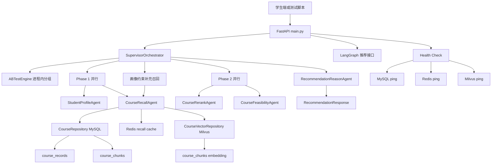
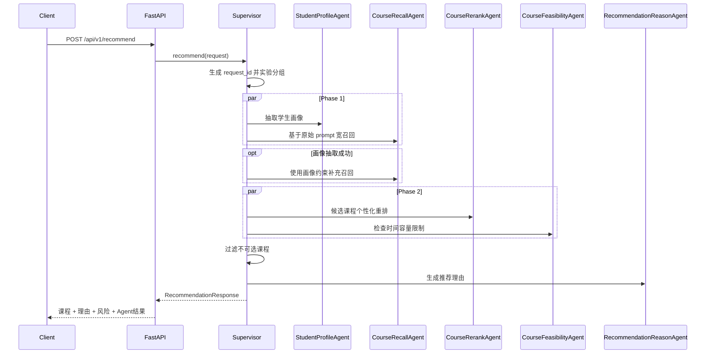
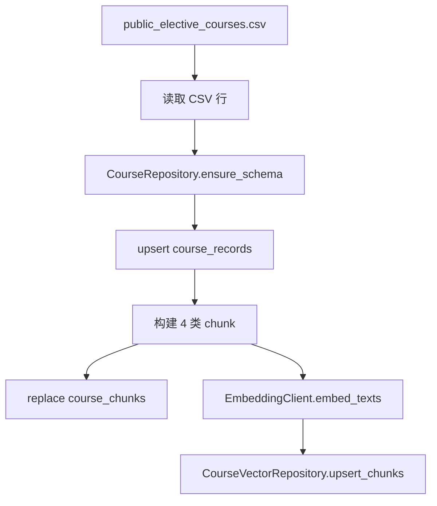

# 系统架构设计文档

本文档描述当前主线：学校公选课 Multi-Agent 推荐系统。历史电商链路仍有部分代码和配置保留，但不再作为本项目对外讲解的主架构。

## 1. 系统边界

当前可运行主链路集中在 `python/`：

| 边界 | 当前职责 | 关键文件 |
|---|---|---|
| API 层 | 暴露推荐、LangGraph 展示、实验状态、指标和健康检查接口 | `python/main.py` |
| 编排层 | 按依赖关系调度 5 个公选课 Agent | `python/orchestrator/supervisor.py` |
| Graph 展示层 | 用 LangGraph 表达同一条推荐流程 | `python/orchestrator/graph.py` |
| Agent 层 | 画像、召回、重排、可行性、推荐理由 | `python/agents/` |
| 数据访问层 | MySQL 课程主表、课程 chunk、Milvus 向量检索、Redis 召回缓存 | `python/repositories/` |
| 数据导入 | 从公选课 CSV 构建 MySQL + Milvus 数据闭环 | `python/scripts/ingest_course_dataset.py` |

需要明确的边界：

- `models/schemas.py` 仍保留 `Product`、`UserProfile` 等电商模型，这是历史兼容，不代表当前公选课主接口依赖这些字段。
- 环境变量仍使用 `ECOM_` 前缀，这是为了不破坏现有 `.env`、容器配置和测试环境。
- Redis 当前已接入课程召回候选 `course_id` 列表缓存；历史 Feature Store 封装仍保留，但尚未成为学生实时画像来源。
- 根目录 `docker-compose.yml`、Java、Go、前端等内容可作为历史对照或扩展参考；当前公选课运行以 `docker-compose.python.yml` 和 `python/` 为准。

## 2. 总体架构

系统入口是 `POST /api/v1/recommend`。`FastAPI` 接收 `RecommendationRequest` 后交给 `SupervisorOrchestrator.recommend()`，最终返回 `RecommendationResponse`。

## 3. 请求链路

### 3.1 输入模型

推荐请求模型在 `python/models/schemas.py`：

| 字段 | 说明 |
|---|---|
| `user_id` | 学生标识，当前也用于实验分组 |
| `scene` | 默认 `course_selection` |
| `num_items` | 期望返回课程数 |
| `prompt` | 学生自然语言选课需求 |
| `query` | 兼容字段；当 `prompt` 为空时作为输入 |
| `context` | 结构化上下文，如避开时间、年级、专业、已修课程 |
| `device_type` | 设备类型，当前主链路未重点使用 |

`SupervisorOrchestrator._request_prompt()` 会按 `prompt -> query -> context["query"]` 的顺序取文本。

### 3.2 三阶段编排

Phase 1 中画像和宽召回可以并行，因为召回可以先用原始 prompt 检索候选课程，不必等待画像。画像成功后再补一次结构化召回，目的是避免只靠宽召回漏掉强约束课程。

Phase 2 中重排和可行性检查可以并行，因为二者都只依赖候选课程池：重排决定顺序，可行性检查决定哪些课程有硬冲突或风险。

推荐理由必须串行执行，因为它依赖最终课程列表和风险提醒。

## 4. Agent 职责矩阵

| Agent | 输入 | 处理逻辑 | 输出 | 降级或约束 |
|---|---|---|---|---|
| `StudentProfileAgent` | `user_id`、`prompt`、`context` | LLM 抽取兴趣、领域、校区、避开时间、考试、作业量、给分、小组偏好 | `StudentProfileResult.profile` | LLM JSON 解析失败时使用关键词启发式画像 |
| `CourseRecallAgent` | `StudentProfile`、`prompt`、`context`、`num_items` | Redis 召回缓存 + MySQL 结构化查询 + Milvus chunk 语义召回 + 候选打分去重 | `CourseRecallResult.courses` | Redis/Milvus 失败时回退原召回；无数据时返回 mock 课程 |
| `CourseRerankAgent` | 学生画像、候选课程 | LLM 从候选课程 ID 内排序，兼顾兴趣、时间、考核、负担、容量和多样性 | `CourseRerankResult.courses` | 无画像或 JSON 解析失败时走规则排序 |
| `CourseFeasibilityAgent` | 学生画像、候选课程、context | 过滤硬冲突，输出容量/考试/小组作业等风险 | `CourseFeasibilityResult` | 纯规则逻辑，不调用 LLM |
| `RecommendationReasonAgent` | 学生画像、最终课程、warnings | 生成 40-80 字推荐理由和风险提示 | `RecommendationReasonResult.reasons` | LLM 失败时用课程字段拼接兜底理由 |

所有 Agent 继承 `BaseAgent`，统一具备：

- 调用计数和错误计数
- 耗时记录
- `tenacity` 指数退避重试
- 异常时返回 `success=False` 的 `AgentResult`

## 5. 数据架构

### 5.1 课程主表

`CourseRepository.ensure_schema()` 会创建 `course_records`：

| 字段 | 用途 |
|---|---|
| `course_id` | 课程唯一标识 |
| `course_name`、`teacher`、`credits` | 基础展示 |
| `course_type`、`course_category`、`domain` | 分类与领域过滤 |
| `campus`、`time_slot` | 校区和时间约束 |
| `capacity`、`current_enrolled`、`popularity_level` | 容量与抢课风险 |
| `tags` | 轻量标签匹配 |
| `raw_json` | 保存 CSV 原始字段，回表时补充完整 `Course` 模型 |

`fetch_courses()` 支持领域、分类、校区、短查询文本过滤，并按热度、已选人数和课程 ID 排序。`fetch_courses_by_ids()` 用于 Milvus 返回 course_id 后回表取完整课程。

### 5.2 课程 chunk 表

`course_chunks` 保存每个课程拆分后的文本片段：

| 字段 | 用途 |
|---|---|
| `chunk_id` | 形如 `GXK2026003:2:learning_profile` |
| `course_id` | 回表关联课程 |
| `chunk_index` | chunk 顺序 |
| `chunk_type` | `basic`、`schedule_capacity`、`learning_profile`、`audience_tags` |
| `content` | 实际参与 embedding 的文本 |
| `metadata_json` | 课程名、教师、领域、分类、标签等辅助信息 |

### 5.3 Milvus 向量库

`CourseVectorRepository` 使用 `course_milvus_collection`，默认 collection 名是 `course_chunks`。Milvus schema：

| 字段 | 类型 | 说明 |
|---|---|---|
| `chunk_id` | VARCHAR primary key | chunk 主键 |
| `course_id` | VARCHAR | 回表课程 ID |
| `chunk_type` | VARCHAR | chunk 类型 |
| `embedding` | FLOAT_VECTOR | 文本向量 |

检索时，`CourseVectorRepository.search()` 先把用户 query 转成向量，再查 Milvus，返回命中的 `chunk_id`。`CourseRecallAgent._semantic_course_ids()` 从 `chunk_id` 中解析出 `course_id`，再通过 MySQL 回表。

### 5.4 Redis 召回缓存

`CourseRecallCacheRepository` 缓存的是结构化画像条件对应的候选 `course_id` 列表，不缓存完整 `Course` 对象。命中缓存后仍调用 MySQL 回表，保证容量、已选人数、限制条件等字段来自最新数据。

| key | value | TTL |
|---|---|---|
| `recall:v1:<hash>` | JSON course_id list | 默认 900 秒 |
| `recall:v1:<hash>:lock` | 短锁标记 | 默认 5 秒 |

`RecallCacheKeyBuilder` 使用领域、分类、校区、考试偏好、作业量、给分友好、小组作业、年级、专业等结构化字段生成稳定 key。多个并发请求同时未命中同一 key 时，先到的请求通过 Redis `SET NX EX` 获取短锁并构建缓存，其余请求短暂等待后优先复用缓存；等待后仍未命中则回退完整召回。

## 6. 数据导入流程

导入入口是 `python/scripts/ingest_course_dataset.py`：

`_build_chunks()` 固定生成四类 chunk：

- `basic`：课程名、原始课程名、教师、学分、课程类型、课程分类、领域
- `schedule_capacity`：校区、时间、地点、容量、已选人数、当前选课比例、热度、抢课建议
- `learning_profile`：简介、考核、难度、作业量、给分友好、考勤、考试、小组作业
- `audience_tags`：年级限制、专业限制、先修要求、适合人群、标签、历史平均选课比例

## 7. API 与观测

| 接口 | 实现 | 说明 |
|---|---|---|
| `GET /health` | `main.health()` | 检查 MySQL、Redis、Milvus |
| `POST /api/v1/recommend` | `main.recommend()` | 生产推荐主链路 |
| `POST /api/v1/recommend/graph` | `main.recommend_via_graph()` | LangGraph 展示链路 |
| `GET /api/v1/experiments` | `main.get_experiments()` | 查看进程内实验状态 |
| `POST /api/v1/experiments/{experiment_id}/outcome` | `main.record_outcome()` | 更新实验结果 |
| `GET /api/v1/metrics` | `main.get_metrics()` | 查看内存指标 |

`MetricsCollector` 当前是进程内指标收集，不是 Prometheus 已接入链路。`prometheus-client` 在依赖中存在，但 Python 主链路没有实际导出 Prometheus 指标端点。

## 8. 稳定性设计

### 8.1 LLM 输出约束

- 学生画像要求只输出 JSON object。
- 课程重排要求只输出候选课程 ID 的 JSON array。
- 推荐理由要求只输出 `[{course_id, reason}]`。
- 代码会去除 Markdown 代码块包裹，再进行 JSON 解析。

### 8.2 失败回退

| 失败点 | 回退方式 |
|---|---|
| Redis 缓存不可用 | 直接走 MySQL + Milvus 原召回链路 |
| 缓存命中但 MySQL 回表为空 | 忽略缓存并走完整召回 |
| 画像 JSON 解析失败 | `_heuristic_profile()` 用关键词和 context 构造画像 |
| Milvus 查询失败 | 返回空语义召回，继续 MySQL 结构化召回 |
| MySQL 和 Milvus 都无候选 | 返回内置 mock 课程，保证演示链路不中断 |
| LLM 重排失败 | `_rule_based_rerank()` 按课程分数、考试、作业量、爆满情况排序 |
| 推荐理由失败 | `_fallback_reasons()` 用课程字段生成解释 |
| Agent 抛异常 | `BaseAgent._fallback()` 返回失败结果，保留错误信息 |

### 8.3 风险透明

可行性 Agent 不会简单把所有有风险课程都删除：

- 时间冲突、年级/专业限制、缺少先修要求属于硬冲突，会进入 `filtered_courses`。
- 爆满、容量紧张、考试偏好不匹配、小组作业偏好不匹配属于风险，会进入 `selection_warnings`。

这样更接近真实选课场景：热门课可能值得冲刺，但系统要提醒学生准备替代方案。

## 9. 已知限制

- 当前课程召回的 MySQL 短文本查询只对较短 query 生效，长 prompt 主要依赖 Milvus 语义召回和画像后的结构化约束。
- `CourseVectorRepository.search()` 返回的是 `chunk_id`，再由召回 Agent 解析 `course_id`；这要求 chunk_id 格式保持 `course_id:index:type`。
- `CourseFeasibilityAgent` 的时间冲突判断是字符串包含匹配，适合演示，不是完整课表冲突算法。
- A/B 实验和 metrics 当前为进程内实现，服务重启后状态不会持久化。
- Redis 已用于课程召回候选缓存；Feature Store 封装存在，但公选课画像目前主要来自 prompt 和 context。
- 根 compose 中提到的网关、微服务和消息队列不是当前公选课 Python 主线的运行前提。

## 10. 面试讲法

可以用这句话概括架构：

> 我没有让 LLM 直接生成课程，而是先把学生需求结构化，再从 MySQL 和 Milvus 中召回真实课程，之后只在候选课程内做 LLM 重排，最后用规则 Agent 检查时间、容量和限制条件，并生成可解释建议。

如果面试官追问“为什么要 Multi-Agent”，重点回答：

- 选课推荐不是单一生成任务，而是理解、检索、排序、约束检查、解释五类任务的组合。
- 拆开后每个阶段能单独失败、单独降级、单独观察耗时。
- 并行编排可以缩短链路延迟：画像和宽召回并行，重排和可行性检查并行。
- 最终课程来自数据库，不由 LLM 自由编造，结果更可信。
