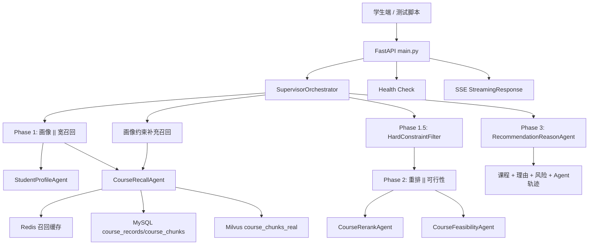
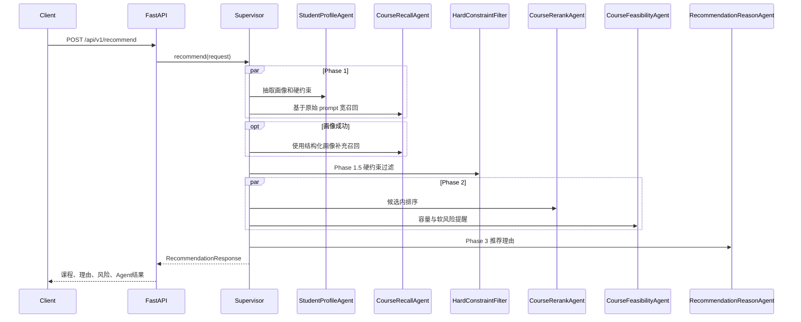

# 系统架构设计文档

本文档只描述当前主线：学校公选课 Multi-Agent 推荐系统。历史电商链路仍有代码、字段和文档保留，但不作为对外主架构讲解。

## 1. 系统边界

当前可运行主链路集中在 `python/`：

| 边界 | 当前职责 | 关键文件 |
| --- | --- | --- |
| API 层 | 推荐、流式推荐、LangGraph 展示、实验状态、指标、健康检查 | `python/main.py` |
| 编排层 | 调度画像、召回、硬约束、重排、可行性、理由生成 | `python/orchestrator/supervisor.py` |
| Agent 层 | 学生画像、课程召回、课程重排、选课可行性、推荐理由 | `python/agents/` |
| 约束层 | 对校区、类别、考试、老师、时间等硬条件做确定性过滤 | `python/orchestrator/hard_constraint_filter.py` |
| 数据访问层 | MySQL 课程事实、Milvus chunk 向量、Redis 召回缓存 | `python/repositories/` |
| 数据导入 | 从公选课 CSV 构建 MySQL + Milvus 数据闭环 | `python/scripts/ingest_course_dataset.py` |

需要说明的历史边界：

- `models/schemas.py` 中仍有 `Product`、`products` 等字段，这是历史兼容，不代表当前主接口推荐商品。
- 环境变量仍使用 `ECOM_` 前缀，这是为了兼容既有 `.env`、容器和测试配置。
- 根目录 `docker-compose.yml`、Java、Go 等内容可作为历史扩展参考；当前公选课运行以 `docker-compose.python.yml` 和 `python/` 为准。

## 2. 总体架构

面试讲法：

> 我把 LLM 放在适合它的位置：理解自然语言、候选内排序、生成解释。课程事实、硬约束和最终结果都由数据库和规则兜底，避免让 LLM 自由编造课程。

## 3. 请求链路

### 3.1 输入模型

`RecommendationRequest` 的关键字段：

| 字段 | 作用 |
| --- | --- |
| `user_id` | 学生标识，也用于进程内实验分组 |
| `prompt` | 学生自然语言选课需求 |
| `query` | 兼容字段，`prompt` 为空时使用 |
| `context` | 结构化上下文，例如年级、专业、避开时间 |
| `num_items` | 期望返回课程数 |

`SupervisorOrchestrator._request_prompt()` 按 `prompt -> query -> context["query"]` 的顺序取实际输入。

### 3.2 编排阶段

设计取舍：

- **Phase 1 并行**：画像和宽召回都可以基于原始请求开始，减少等待。
- **画像后补召回**：如果画像抽到领域、类别、校区等结构化字段，再补一次召回，避免宽召回漏掉强约束课程。
- **Phase 1.5 硬约束**：明确条件先过滤，再让重排处理软偏好，避免违规课程被 LLM 排回结果。
- **Phase 2 并行**：重排决定顺序，可行性输出容量和风险，两者都依赖候选池但互不依赖。
- **Phase 3 串行**：推荐理由依赖最终课程和风险提醒，必须最后执行。

## 4. Agent 职责矩阵

| Agent / 组件 | 输入 | 输出 | 失败处理 |
| --- | --- | --- | --- |
| `StudentProfileAgent` | `user_id`、`prompt`、`context` | 学生画像、硬约束 | LLM JSON 失败时走关键词启发式 |
| `CourseRecallAgent` | 画像、prompt、context、数量 | 候选课程列表、召回策略 | Redis/Milvus 失败时回退 MySQL；无数据时 mock 兜底 |
| `HardConstraintFilter` | 候选课程、硬约束 | 过滤后课程、过滤原因、warning | 候选不足时给 warning，不自动放宽 |
| `CourseRerankAgent` | 学生画像、候选课程 | 排序后课程 | LLM 排序失败时走规则排序 |
| `CourseFeasibilityAgent` | 学生画像、候选课程 | 容量、爆满、小组作业等风险 | 纯规则逻辑，不依赖 LLM |
| `RecommendationReasonAgent` | 最终课程、画像、风险 | 推荐理由 | LLM 失败时用课程字段拼接理由 |

所有 Agent 继承 `BaseAgent`，统一处理耗时、重试、错误计数和 fallback。

## 5. 数据架构

### 5.1 MySQL：课程事实源

`course_records` 保存课程主字段和 `raw_json`。`raw_json` 用于回表时补齐字段，避免表结构每次跟着 CSV 字段大改。

`course_chunks` 保存每门课的文本片段：

| chunk 类型 | 主要内容 | 面试讲法 |
| --- | --- | --- |
| `basic` | 课程名、教师、学分、类型、分类、领域 | 解决“这是什么课” |
| `schedule_capacity` | 校区、时间、地点、容量、热度 | 解决“能不能选、难不难抢” |
| `learning_profile` | 简介、考核、难度、作业、考试、小组作业 | 解决“学起来轻不轻松” |
| `audience_tags` | 年级/专业/先修、适合人群、标签 | 解决“适不适合这个学生” |

### 5.2 Milvus：语义召回

Milvus collection 默认配置为 `course_chunks_real`，向量维度按项目配置为 1152。检索时先把用户 query 转成向量，命中 chunk 后解析 `course_id`，再回 MySQL 拿完整课程。

设计取舍：

- 不把整门课合成一个向量，避免字段语义互相稀释。
- 不让 Milvus 承担事实判断，避免只凭向量片段做容量、时间和限制条件判断。

### 5.3 Redis：召回候选缓存

Redis 缓存的是候选 `course_id` 列表，不是完整 `Course` 对象。

| key 类型 | value | 目的 |
| --- | --- | --- |
| `recall:v1:<hash>` | JSON course_id list | 复用结构化画像召回结果 |
| `recall:v1:<hash>:lock` | 短锁标记 | 降低同 key 并发击穿 |
| 语义缓存索引 | 相似 prompt / key 信息 | 让相近措辞复用召回候选 |

命中缓存后仍回 MySQL，是因为课程容量、已选人数和限制条件可能变化。

## 6. API 与流式输出

| 接口 | 说明 |
| --- | --- |
| `GET /health` | 检查 MySQL、Redis、Milvus |
| `POST /api/v1/recommend` | 同步推荐主链路 |
| `POST /api/v1/recommend/stream` | SSE 流式推荐主路径 |
| `POST /api/v1/stream_recommend` | 流式推荐别名，兼容脚本和文档 |
| `POST /api/v1/recommend/graph` | LangGraph 展示链路 |
| `GET /api/v1/metrics` | 进程内指标，不是 Prometheus 生产指标 |

SSE 事件强调链路可见性：`start`、`phase1_complete`、`phase15_complete`、`phase2_complete`、`phase3_start`、token 文本、`phase3_complete`、`done`。

## 7. 稳定性与降级

| 风险点 | 处理方式 |
| --- | --- |
| LLM 输出非 JSON | 去除代码块后解析，失败时 fallback |
| 画像失败 | 关键词启发式画像 |
| Redis 不可用 | 跳过缓存，走完整召回 |
| Milvus 或 embedding 失败 | 语义召回为空，保留 MySQL 结构化召回 |
| 硬约束过滤后不足 | 返回不足 warning，不偷偷放宽 |
| LLM 重排失败 | 规则排序 |
| 推荐理由失败 | 字段拼接兜底理由 |
| 流式 Phase 3 慢 | Phase 3 token 流单独计算超时 |

面试讲法：

> 我会把失败当成链路中的常态来设计。每个 Agent 失败后要么有可解释 fallback，要么把失败信息放进 `agent_results`，这样接口可以返回但不会假装一切正常。

## 8. 已知限制

- 时间冲突判断仍偏轻量，不是完整课表时间段算法。
- A/B 实验和 metrics 是进程内实现，重启后状态不持久。
- Redis 已用于召回候选缓存，但学生实时行为画像未接入主链路。
- 语义缓存阈值需要更多真实 query 样本调优。
- 真实业务指标、线上延迟和用户满意度均待补充。

## 9. 可追问点

- 为什么不让 LLM 直接推荐课程？
- 为什么硬约束过滤放在召回后、重排前？
- Redis 只缓存候选 ID 有什么利弊？
- 如果 MySQL 和 Milvus 数据不一致怎么排查？
- Graph 版本和 Supervisor 版本为什么并存？
- 哪些指标能证明工程正确，哪些指标还不能写进简历？
