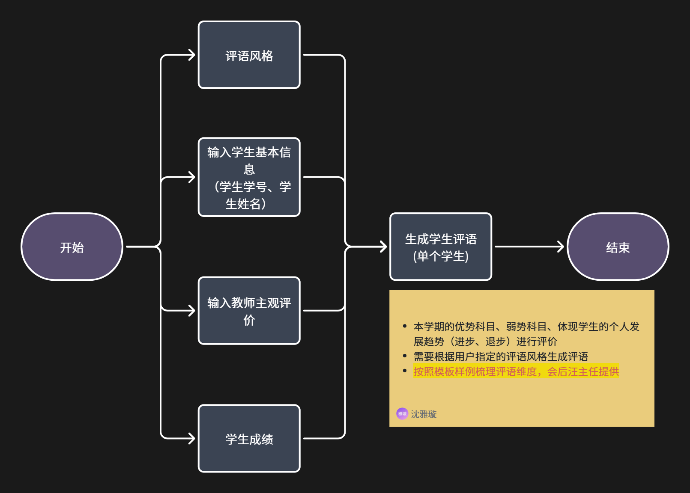
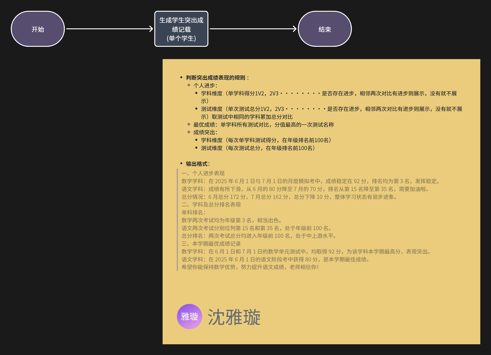
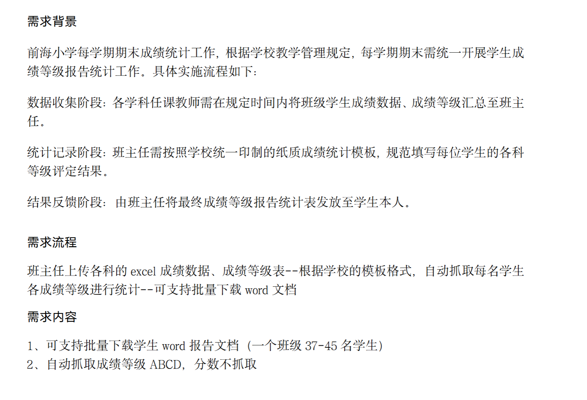
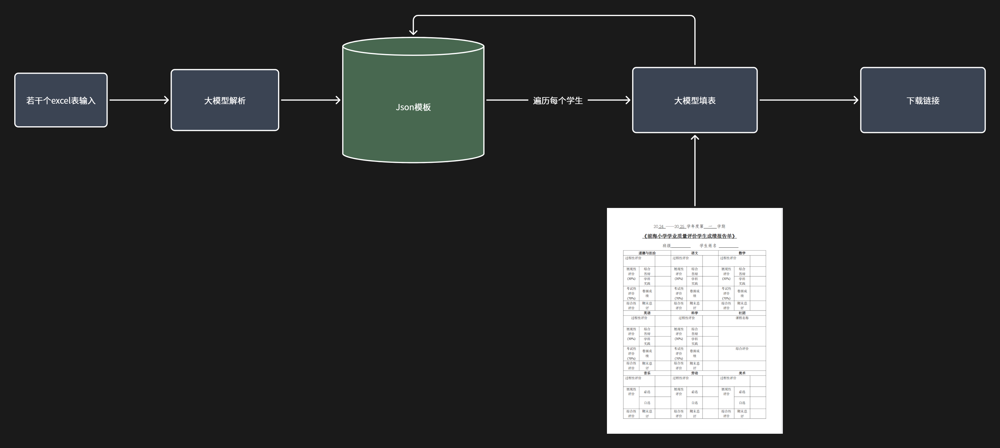

# Multi-agent 项目升级为V2.0.0的需求设计

## V1.0.0的瓶颈:

 - 这就是一个简陋的rag工程，提示词工程，一个问答然后走知识库重排过滤打分最后流式输出返回；没有真正体现多agent的活性，也没有体现真正agent工程的多方落地参考要素；项目深度不够，无法通过该项目考察开发者的agent应用落地能力。
 - 使用的技术栈过于简陋，可参考多方面市面上的主流框架和api设计，通过github或网页搜索进行一定的了解，优化这个项目的技术栈。
 - 实现核心功能实际就是一个推荐接口--需要新增多个跟学生相关的垂直业务场景，由此扩展出多个接口--例如学生对话中根据他提供的成绩单csv数据，生成一份期末课程报告分析（html/word文档下载链接），各种理性分析+感性回答（评语和鼓励的话语）；这是一个例子，还有许多可列举。比如分析成绩，比如能回答大学领域里面的问题（大学生想要知道学校的一些规章制度，咨询）。

## 参考点：

- 参考E盘下的agent目录openmaic和fastgpt项目，使用这个项目去驱动二次更改定制化的这两个项目，来匹配大学生教务系统这个业务多方面业务的新增功能点。这个项目可以使用openai sdk又或是deepagents框架又或是其他来完善，最终融合成大的agent项目。

- 打造独属的知识库，合理运用minio，mysql，milvus三方进行综合管理教务系统的私有知识；需要开放专门的文档上传/分切/解析这类接口，避免脚本写死上传；

- 项目的编排要体现是如何管理llm的上下文；防止出现幻觉，增强回答准确性。工具调用顺序链是怎么样的；调用失败如何进行兜底，具体机制设计。这些等等可以参考像claudecode,pi agent这类优秀的agent项目。

- 参考fastgpt，可以设置自定义的skill--可以让ai使用一些主流的封装工具，网页搜索，生成word，pdf报告，两者转换。

- 智能体编排参考，这是教师寄语，可以改成大学生成绩评语功能；流程一样

- 成绩记载功能--智能体编排参考，同理转变为大学生的场景

- 背景：改为大学生期末修的课程的需求背景，流程以及内容，功能点是一样的。

- 智能体编排思路，下载链接点进去后是批量下载学生报告的word文档。

- 官方文档（可参考）：

https://doc.fastgpt.cn/

https://milvus.io/docs/zh

https://docs.langchain.com/

- 跨语言：接入ts，多语言之间的通信要做好。

- 源码参考位置："E:\Agent\pi"  "E:\Agent\claude-code" "E:\Agent\OpenMAIC" "E:\Agent\FastGPT"

