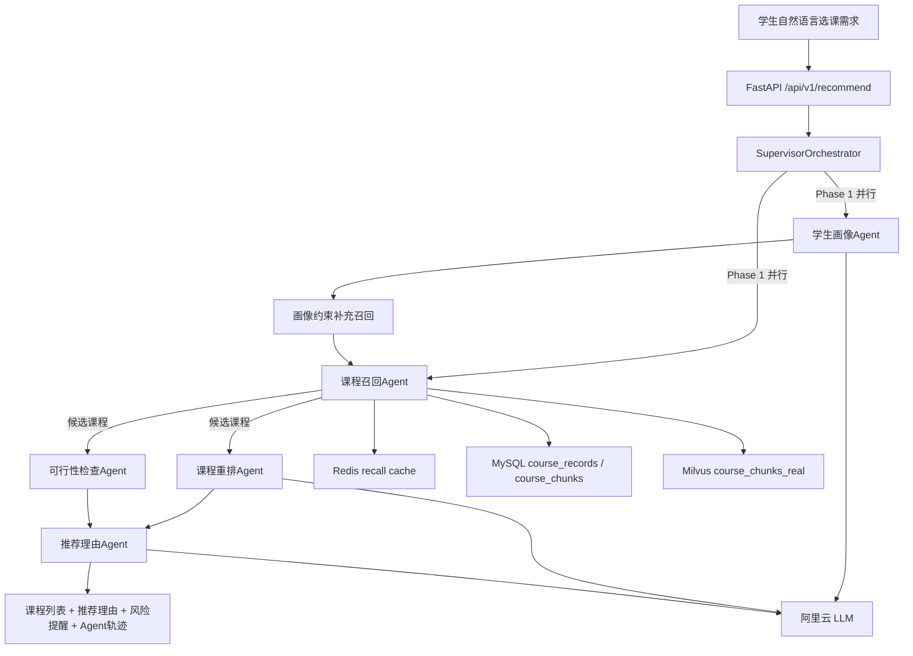

# 学校公选课 Multi-Agent 推荐系统 — 从零到面试全攻略

## 一、调研结论：企业级多Agent项目参考

### 1.1 GitHub 顶级参考项目

- **LangGraph 官方多 Agent / StateGraph 示例**（`langchain-ai/langgraph`）
  - 可参考状态图、Supervisor 编排、节点失败回退等工程模式
  - 对本项目的启发：把“理解学生、找课程、排顺序、查风险、解释原因”拆成可追踪节点
  - 面试讲法：不是为了堆 Agent，而是为了让每一步都有输入、输出和可定位的失败点

- **Spring AI Alibaba Multi-Agent Demo** (`spring-ai-alibaba/spring-ai-alibaba-multi-agent-demo`)
  - Java 企业级，Supervisor + 子 Agent 协同
  - 技术栈：Spring AI Alibaba + MySQL + Redis + Nacos + MCP协议
  - 对本项目的启发：保留 Java/Spring 生态对照，面试时可说明 Python 主链路如何迁移到 Spring 服务层

- **Milvus / RAG 示例项目**（`milvus-io` 生态）
  - 可参考向量库 collection、embedding 维度、分块检索、回表补全等做法
  - 对本项目的启发：课程整行直接 embedding 噪声较大，所以拆成 `basic`、`schedule_capacity`、`learning_profile`、`audience_tags` 四类 chunk

- **教育推荐 / 课程推荐相关论文与项目**
  - 关注点不是交易转化，而是学生偏好、时间冲突、容量风险、考核方式和可解释推荐
  - 对本项目的启发：推荐理由必须能落到课程字段和风险提醒，而不是只给相似度分数

### 1.2 三大框架对比

- **Python FastAPI + 自研 Supervisor（当前主链路）**：代码量少、调试直观，适合把公选课推荐链路快速跑通并展示 Agent 轨迹。
- **LangGraph（展示/扩展链路）**：适合把推荐流程画成状态图，当前项目保留 `/api/v1/recommend/graph` 用于说明图式编排。
- **Spring AI Alibaba / Go 并发编排（对照方案）**：用于面试横向比较企业 Java 生态和高并发 Go 编排，但当前分支不作为主实现。

### 1.3 行业趋势

- 面试里更看重“为什么拆 Agent、怎么排查、怎么降级”，而不是只说用了某个框架。
- 课程推荐类项目更适合讲约束推理：时间、校区、容量、考试、小组作业、专业/年级限制都能形成真实业务问题。
- 企业项目展示要能闭环：数据导入、MySQL 回表、Milvus 召回、Redis 缓存、FastAPI 接口、Docker 启动和日志验证都要讲得清楚。

---

## 二、项目架构设计

### 2.1 系统总览



### 2.2 四大Agent详细设计

**学生画像Agent**
- 从自然语言中抽取兴趣领域、校区偏好、时间限制、考核偏好、作业量、给分倾向等结构化字段
- 画像抽取失败时可回退启发式规则，避免整条推荐链路直接失败
- 输出 `StudentProfile`，作为课程召回和推荐解释的约束输入

**课程召回Agent**
- 先基于原始 prompt 做宽召回，再结合学生画像补充结构化召回
- Redis 缓存相似需求的候选 `course_id` 列表，减少重复 MySQL + Milvus 检索
- MySQL 负责课程结构化字段回表，Milvus 负责课程 chunk 语义召回

**课程重排Agent**
- 在候选课程 ID 范围内调用 LLM 做个性化排序
- 解析失败时回退规则排序，避免 LLM 输出格式异常导致接口不可用
- 排序依据围绕兴趣匹配、时间偏好、考核方式、作业负担和课程热度展开

**可行性检查Agent**
- 检查容量爆满、容量紧张、时间冲突、年级/专业/先修限制等风险
- 将硬冲突和软风险拆开，便于最终推荐理由解释“为什么推荐/为什么提醒”
- 这部分不依赖 LLM，优先用规则保证稳定性

**推荐理由Agent**
- 基于最终课程列表、学生画像和风险结果生成可执行建议
- 输出不仅是“推荐理由”，还要说明适合点、风险点和选课建议
- LLM 失败时可回退字段拼接，保证接口仍能返回可读结果

### 2.3 技术亮点

- **课程分块向量化**：每门课拆成 `basic`、`schedule_capacity`、`learning_profile`、`audience_tags` 四类 chunk，避免整行 embedding 混杂时间、容量和学习体验。
- **Redis 热点召回缓存**：相似需求复用候选 `course_id`，命中后仍回 MySQL 拿最新容量和限制字段，避免缓存过期信息直接返回给学生。
- **三阶段 Supervisor 编排**：画像/召回并行，重排/可行性并行，推荐理由串行，既能降延迟，也能保留清晰的 Agent 执行轨迹。

---

## 三、三语言实现方案

### 3.1 Python版（推荐入门，代码量最少）

- **框架**：FastAPI + 自研 SupervisorOrchestrator，另保留 LangGraph 展示入口
- **LLM**：阿里云 OpenAI 兼容接口，当前配置示例为 `deepseek-v4-pro`
- **存储**：MySQL（课程结构化数据）+ Redis（召回缓存）+ Milvus（课程 chunk 向量）
- **Web**：FastAPI
- **核心文件结构**：
  - `agents/student_profile_agent.py` - 学生画像 Agent
  - `agents/course_recall_agent.py` - 课程召回 Agent
  - `agents/course_rerank_agent.py` - 课程重排 Agent
  - `agents/course_feasibility_agent.py` - 可行性检查 Agent
  - `agents/recommendation_reason_agent.py` - 推荐理由 Agent
  - `orchestrator/supervisor.py` - Supervisor编排器
  - `repositories/mysql_repository.py` - MySQL 课程数据访问
  - `repositories/course_recall_cache_repository.py` - Redis 召回缓存
  - `repositories/course_vector_repository.py` - Milvus 课程向量检索
  - `scripts/ingest_course_dataset.py` - CSV 课程数据入库脚本

### 3.2 Java版（企业级，Spring生态）

- **框架**：Spring AI Alibaba + Spring Boot 3（当前作为面试扩展方案）
- **LLM**：阿里云 OpenAI 兼容模型
- **存储**：Redis + Milvus + MySQL
- **核心模块**：
  - `agent/` - 学生画像、课程召回、重排、可行性、推荐理由 Agent
  - `orchestrator/` - Supervisor 编排（Tool Calling / workflow 模式）
  - `service/` - 课程查询、召回缓存、推荐解释服务
  - `config/` - MySQL / Redis / Milvus / LLM 配置

### 3.3 Go版（高并发，云原生）

- **框架**：LangChainGo + 自研编排层（当前作为高并发对照方案）
- **LLM**：阿里云 OpenAI 兼容模型
- **存储**：Redis + Milvus + MySQL
- **亮点**：用 goroutine 并行画像/召回、重排/可行性检查，用 channel 聚合结果
- **核心模块**：
  - `agent/` - 公选课推荐各 Agent（接口+实现）
  - `orchestrator/` - 基于goroutine的并行编排
  - `handler/` - HTTP Handler
  - `repository/` - MySQL / Redis / Milvus 访问层

---

## 四、面试全套材料

### 4.1 简历项目经验写法

```
学校公选课 Multi-Agent 推荐系统 | 独立项目 | 2026.01-2026.03
- 设计并实现基于 Supervisor 的公选课推荐链路，将学生画像、课程召回、课程重排、
  可行性检查、推荐解释拆成独立 Agent，支持 Agent 执行轨迹和耗时观测
- 基于 MySQL + Milvus + Redis 打通课程数据闭环：CSV 入库、课程 chunk 向量化、
  语义召回、结构化回表和热点召回缓存
- 接入阿里云 LLM / embedding 服务，将自然语言选课需求转成结构化画像，并生成
  可解释的课程推荐理由和风险提醒
- 使用 Docker Compose 一键启动 FastAPI、MySQL、Redis、Milvus、etcd、MinIO，
  支持 `/health` 与推荐接口联调验证
- 技术栈：Python/FastAPI/Supervisor | MySQL/Redis/Milvus | Docker Compose
```

### 4.2 STAR法面试话术

**一句话电梯稿（20 字内）**：我做了一个能解释风险的公选课推荐系统。

**S（Situation）**：学生选公选课时，需求通常不是一个关键词能表达的。比如“不考试、作业少、给分友好、东校区、周三晚上不要上课、不要小组作业”，这里同时包含兴趣、时间、校区、考核方式、容量风险和个人偏好。普通搜索只能匹配课程名或标签，很难把这些约束一起处理，也很难解释为什么推荐这门课、为什么提醒风险。

**T（Task）**：我的目标是把自然语言选课需求变成一条可验证的推荐链路：先理解学生偏好，再从真实课程数据中召回候选课，随后排序、检查时间/容量/限制风险，最后给出可解释推荐理由。我的职责主要是设计 Agent 拆分、实现 Python 主链路、接入 MySQL / Redis / Milvus / LLM，并整理成可面试讲清楚的项目。

**A（Action）**：
- 原来如果只做一个大 Agent，让它同时理解需求、查课程、排序和解释，短期能跑，但失败时很难判断是画像抽取错了、召回没命中、排序不合理，还是风险检查漏了。
- 我把链路拆成三阶段：第一阶段并行跑学生画像 Agent 和课程召回 Agent；如果画像抽取成功，再用画像里的校区、领域、时间偏好补一次结构化召回。第二阶段并行做课程重排和可行性检查。第三阶段再生成推荐理由，因为解释必须依赖最终课程和风险结果。
- 数据层我做了两层设计：MySQL 存课程完整结构化字段和 chunk 元数据，Milvus 存课程 chunk embedding，Redis 缓存热点需求的候选 `course_id`。命中缓存后仍然回 MySQL 拿最新容量和限制字段，避免把过期容量直接推荐给学生。
- 课程向量化时没有把整行 CSV 直接 embedding，而是拆成 `basic`、`schedule_capacity`、`learning_profile`、`audience_tags` 四类 chunk。这样“东校区”“不考试”“作业少”“适合低年级”这类需求能命中更具体的课程片段。
- 我没有把所有判断都交给 LLM：时间冲突、容量紧张、年级/专业限制这类可确定规则放在可行性检查 Agent 里做；LLM 更适合画像抽取、排序解释和推荐理由生成。

**R（Result）**：
- 当前项目已经形成可运行闭环：Docker Compose 能拉起 FastAPI、MySQL、Redis、Milvus、etcd、MinIO；课程 CSV 可通过入库脚本写入 MySQL 和 Milvus；推荐接口能返回课程列表、推荐理由、风险提醒和 Agent 执行轨迹。
- 可量化指标需要用真实压测补充，建议保留为 `[待你补充：推荐接口平均耗时 / P95 / P99]`、`[待你补充：课程数据量、chunk 数、召回耗时]`。不要在简历里直接写没有验证过的点击率或准确率。
- 仍不完善的地方是：真实线上反馈闭环还没有做，后续可以加入学生点击/收藏/最终选课结果，用来优化重排策略和缓存命中策略。

**口播版（60～90 秒）**：
这个项目解决的是学校公选课推荐问题。学生的需求往往不是简单搜课程名，比如他可能同时说“不考试、作业少、给分友好、东校区、周三晚上不要有课”。普通搜索很难同时处理这些约束，也很难告诉学生为什么推荐、有什么风险。

所以我把推荐链路拆成多个 Agent。第一阶段并行做学生画像和课程召回，画像抽取成功后再补一次结构化召回；第二阶段并行做课程重排和可行性检查；第三阶段基于最终课程和风险结果生成推荐理由。这样如果结果不对，我能判断是画像、召回、排序还是风险检查出了问题。

数据层我用 MySQL 存课程结构化字段，用 Milvus 做课程 chunk 语义召回，用 Redis 缓存热点需求的候选课程 ID。这里 Redis 只缓存候选 ID，不缓存完整课程对象，命中后仍回 MySQL 拿最新容量和限制字段。这个设计让项目不是停留在 Agent 概念上，而是能跑通数据导入、召回、排序、风险检查和接口返回。

**展开版（2～3 分钟）**：
这个项目的背景是学生选公选课时，需求通常是混合约束。比如一个学生可能想要“不考试、作业少、给分友好、最好东校区、周三晚上不要上课”，这里既有兴趣偏好，也有时间、校区、考核方式和容量风险。只靠关键词搜索，很容易只命中课程名，却忽略“不要考试”或“时间冲突”这些真正影响选课决策的因素。

我一开始考虑过用一个 Agent 完成全部事情，但这样 prompt 会很长，工具职责也混在一起。推荐结果不好时，很难判断是需求理解错了，还是课程召回少了，或者是最后解释阶段编造理由。所以我改成 Supervisor 编排：Phase 1 并行跑学生画像 Agent 和课程召回 Agent；画像成功后，根据领域、分类、校区等约束补一次召回。Phase 2 并行做课程重排和可行性检查。Phase 3 再做推荐理由，因为理由必须基于最终课程和风险结果。

数据层上，我把课程 CSV 导入成两部分：MySQL 保存完整课程记录和 chunk 元数据，Milvus 保存 chunk embedding。课程不是整行直接向量化，而是拆成 basic、schedule_capacity、learning_profile、audience_tags 四类 chunk，这样学生说“东校区”会更容易命中时间地点相关片段，说“不考试、作业少”会更容易命中学习体验片段。Redis 只缓存热点需求对应的候选 course_id，命中后仍回 MySQL 查询最新容量和限制，避免缓存里的课程状态过期。

这个方案的取舍是，多 Agent 编排比单 Agent 复杂，需要处理状态传递、失败回退和日志观测。但它的好处是每一步都能定位和解释，面试时也能讲清楚为什么这样拆。现在项目已经能通过 Docker Compose 启动依赖栈，并通过入库脚本和推荐接口跑通主链路。后续如果继续完善，我会补真实压测指标和学生反馈闭环，用点击、收藏或最终选课结果来优化重排。

**避免“报菜名”的替换表（针对本段经历）**：

| 可空泛的说法 | 建议改成的“动作句” |
|------------|-------------------|
| 我用了多 Agent 架构 | 我把“理解学生、找课程、排顺序、查风险、解释原因”拆成独立 Agent，方便定位是哪一步影响了推荐结果 |
| 我用了 Redis、Milvus、MySQL | 我让 Redis 只缓存候选课程 ID，Milvus 负责语义召回，MySQL 回表拿最新容量和限制字段 |
| 我做了 RAG | 我把每门课拆成四类 chunk，让“东校区”“不考试”“作业少”分别命中更具体的课程片段 |
| 我接了 LLM | 我把 LLM 用在画像抽取、重排解释和推荐理由上，把时间冲突、容量限制这类确定规则留给代码判断 |
| 推荐效果很好 | 如果没有真实实验数据，就说当前完成了可运行闭环，性能和效果指标需要补压测或用户反馈 |

**自测（是否还像背文档）**：
- [ ] 开场 30 秒内出现了“学生选课/混合约束/普通搜索不足”
- [ ] 至少 1 处讲清了“单 Agent 全包的问题”和“拆成三阶段后的变化”
- [ ] 至少 1 个句子主语是“我”，并带有具体动作
- [ ] 没有连续 3 个纯技术名词无解释
- [ ] 指标不造假，未知处用 `[待你补充：...]`

### 4.3 八股文必备知识点

**Q1: 为什么选择Multi-Agent而不是单Agent？**
- 公选课推荐里同时有需求理解、课程召回、排序、风险检查和解释，单 Agent 全包会导致 prompt 过长、工具职责混杂。
- 拆成多个 Agent 后，可以定位问题来源：是画像抽取错、召回没命中、排序不合理，还是风险检查漏了。
- 画像/召回、重排/可行性检查可以并行执行，延迟由最慢阶段决定，不必所有步骤串行。
- 每个 Agent 可单独降级，例如 LLM 重排失败回退规则排序，推荐理由失败回退字段拼接。

**Q2: Supervisor模式 vs Handoffs模式？**
- Supervisor：集中控制，适合本项目这种流程明确的推荐任务；学生请求进来后，画像、召回、重排、检查、解释的顺序比较固定。
- Handoffs：更适合开放式对话，例如咨询机器人在多个专家 Agent 之间转交控制权。
- 本项目采用 Supervisor，是为了保留清晰的阶段边界、耗时统计和失败回退点。

**Q3: 如何保证Agent调用的稳定性？**
- LLM 输出解析失败时做清理和回退：画像失败走启发式画像，重排失败走规则排序，推荐理由失败走字段拼接。
- 可确定逻辑尽量不用 LLM，例如时间冲突、容量爆满、年级/专业限制由规则判断。
- 依赖状态通过 `/health` 暴露，重点检查 MySQL、Redis、Milvus、LLM 和 embedding provider。
- Agent 执行结果和耗时进入响应轨迹，便于定位哪一步慢或失败。

**Q4: 实时特征怎么做的？**
- 当前主链路不做通用行为序列特征，而是用 Redis 做课程召回热点缓存。
- cache key 来自结构化画像，例如校区、领域、分类、考核偏好等稳定字段。
- 缓存值只保存候选 `course_id` 列表；命中后仍回 MySQL 查询最新课程，保证容量和限制字段不过期。
- 未命中时用短锁防击穿，拿到锁的请求执行 MySQL + Milvus 完整召回并写回缓存。

**Q5: A/B测试怎么设计？**
- 当前项目保留实验分组能力，可按学生 ID、会话 ID 或请求哈希做稳定分桶。
- 实验对象可以是召回策略、重排 prompt、topK、缓存 TTL 或推荐理由模板。
- 指标不要写交易转化类指标，公选课场景更适合看点击课程详情、收藏、加入备选、最终选课成功率和风险提醒采纳率。
- 目前真实反馈闭环未完成，简历中应写 `[待你补充：真实实验指标]`，不要虚构提升比例。

**Q6: ReAct模式详解？**
- ReAct 是 Thought -> Action -> Observation 循环，适合需要边查工具边推理的任务。
- 本项目主链路没有强行把每个 Agent 都做成 ReAct，而是把“查数据”和“规则判断”显式写进仓储层和可行性检查里。
- 面试可以说：如果后续扩展成可对话选课助手，ReAct 更适合让 Agent 主动查询课程、解释限制、继续追问学生偏好。

**Q7: 记忆系统如何设计？**
- 当前短期状态由 Supervisor 在一次推荐请求内传递，包括画像、候选课程、排序结果、风险结果和推荐理由。
- Redis 更像召回缓存，不保存完整学生隐私画像，只缓存可复用的候选课程 ID。
- Milvus 存的是课程 chunk 向量，不是学生长期记忆。
- 如果后续做个性化长期记忆，可以新增学生选课反馈表，把点击、收藏、最终选课结果作为重排特征。

**Q8: 如何处理Agent间的决策冲突？**
- 课程重排 Agent 可能认为某门课很匹配，但可行性检查 Agent 发现时间冲突或容量爆满，此时风险检查优先进入最终解释。
- Supervisor 不简单丢弃所有风险课程，而是区分硬冲突和软风险：硬冲突应过滤或降权，容量紧张可保留但明确提醒。
- 推荐理由 Agent 必须基于最终课程列表和风险结果生成，不能脱离可行性检查单独编造理由。

---

## 五、项目目录结构

```
multi-agent-ecommerce-system/
├── README.md                 # 项目介绍 + 快速开始
├── docker-compose.python.yml # 公选课 Python 主链路 Compose
├── docker-compose.python.pull-mirror.yml
├── course_dataset_tools/
│   └── output/public_elective_courses.csv
├── python/                   # Python实现
│   ├── requirements.txt
│   ├── main.py
│   ├── agents/
│   ├── orchestrator/
│   ├── repositories/
│   ├── services/
│   ├── scripts/
│   └── tests/
├── scripts/
│   └── init-db.sql           # MySQL 首次初始化表结构
├── docs/                     # 文档与面试材料
└── docker-compose.yml        # 历史/对照栈，当前主链路不以它为准
```

---

## 六、实施计划

分阶段实施，每个阶段都可以独立展示：

**Phase 1 - 核心骨架（Python版）**
- FastAPI 推荐接口与 `/health`
- Supervisor 三阶段编排
- 学生画像、课程召回、课程重排、可行性检查、推荐理由 Agent
- 阿里云 LLM 接入与失败回退

**Phase 2 - 特征与存储**
- MySQL `course_records` / `course_chunks`
- Redis 课程召回缓存与防击穿锁
- Milvus `course_chunks_real` 向量检索
- CSV 课程数据分块入库脚本

**Phase 3 - A/B测试与监控**
- Agent 执行轨迹与耗时统计
- 实验分组字段与策略对照
- `/health` 依赖状态检查
- Docker 日志排障流程

**Phase 4 - Java版实现**
- 作为面试扩展方案说明 Spring AI Alibaba 如何承接同一套 Agent 职责
- Java 业务层日志遵循 `LogManager.getLogger()` 规范
- 当前分支主链路仍以 Python 实现为准

**Phase 5 - Go版实现**
- 作为高并发编排对照方案
- 用 goroutine 并行画像/召回、重排/可行性检查
- 当前分支不以 Go 作为主实现

**Phase 6 - 文档与面试材料**
- README 公选课主链路说明
- STAR 话术改成“学生选课混合约束”故事
- 八股问答围绕 Agent 拆分、召回缓存、课程分块、可行性检查
- 简历指标只保留真实可验证项，未知指标用 `[待你补充]`

**Phase 7 - 上传GitHub**
- README完善
- Docker Compose 一键部署
- 启动命令、健康检查、入库脚本和推荐接口验证说明
